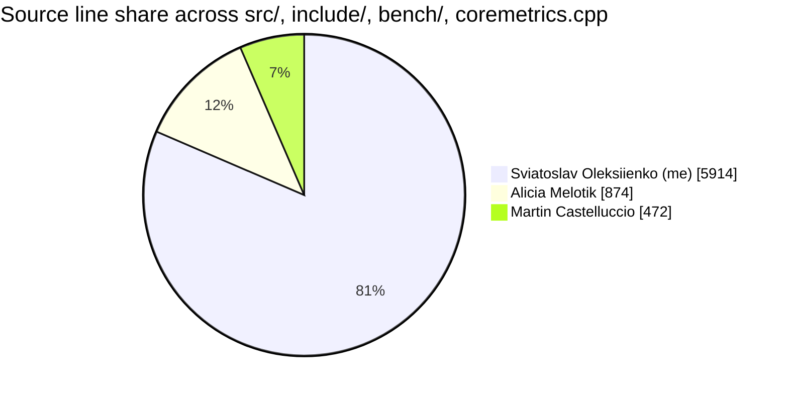

<!-- contribution:start -->

## Team and my contribution

A 4-person Notre Dame CSE 40232 software-engineering project (SP26 Team 04), three months, a PR-template + required-review workflow with per-developer branches. I was the lead and primary author: **81.5% of the source by line** (git-blame verified, recomputed on every push to `main`).

_The block below is regenerated by [`scripts/compute-contributions.sh`](scripts/compute-contributions.sh) on every push to `main` via the `Contribution badge` workflow. Don't edit between the markers — your edit will be overwritten._

### Lines of code by author

| Author | Lines | Share |
| --- | ---: | ---: |
| **Sviatoslav Oleksiienko (me)** | 5914 | `████████████████░░░░` 81.5% |
| Alicia Melotik | 874 | `██░░░░░░░░░░░░░░░░░░` 12.0% |
| Martin Castelluccio | 472 | `█░░░░░░░░░░░░░░░░░░░` 6.5% |

_Run \`scripts/compute-contributions.sh\` locally to reproduce these numbers from your checkout._

<!-- contribution:end -->
