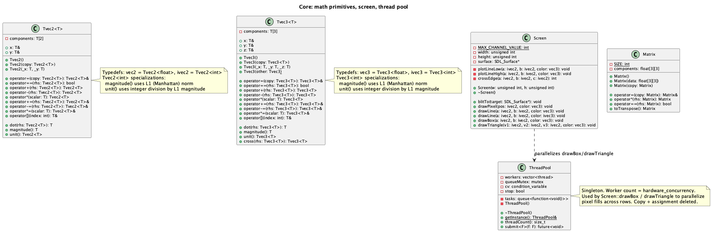
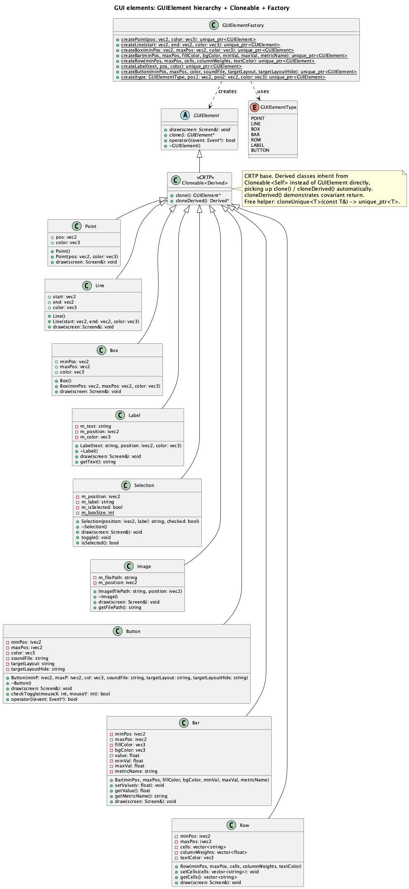
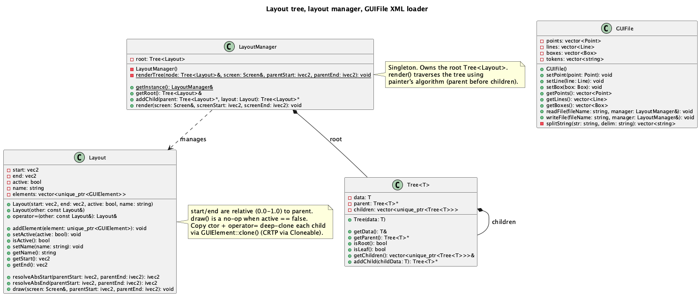
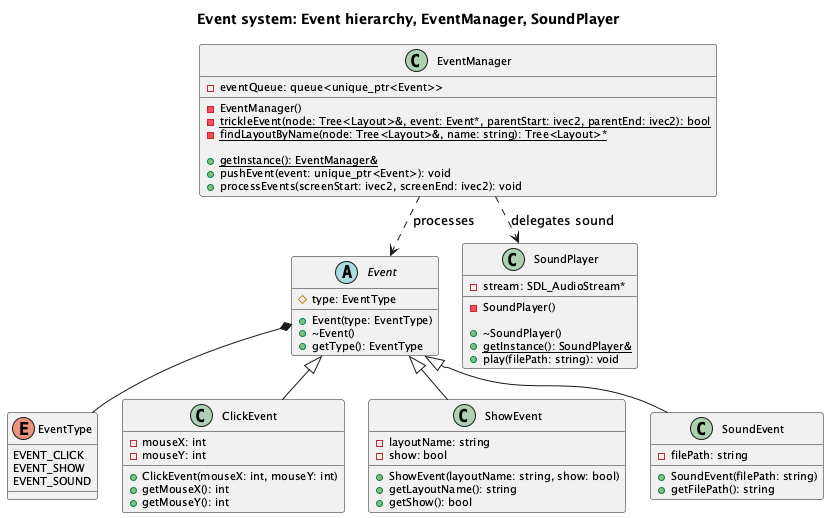
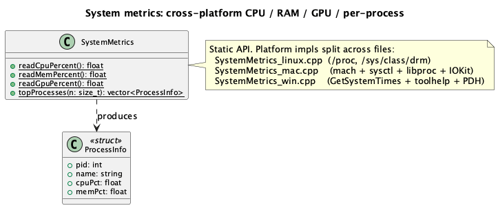

# SP26_Team04

## Class Diagram

High-level overview, grouped by package:


Per-package detail diagrams (each is small enough to fit on a normal screen):

- Core (math + Screen + ThreadPool): 
- GUI elements (GUIElement hierarchy + Cloneable + Factory): 
- Layout (Tree, Layout, LayoutManager, GUIFile): 
- Events (Event hierarchy, EventManager, SoundPlayer): 
- System metrics: 

The single combined diagram in `uml/classes.puml` is kept for archival reference; it renders wide and is not embedded here.

---

## Global Requirements

### Design and Architecture

- Avoid code smell. A code smell is a noticeable pattern in source code that suggests an underlying design or maintainability problem, even though the code still works correctly.
- If you require additional functions to complete a task that are not part of the public-facing requirement, do not make them public.
- Do not use `#pragma once` — use `#ifndef` header guards instead.
- No exceptions or assertions. Print to `std::cerr` with a helpful message, but all corner cases must be handled without crashing the app.
- No print statements in production code.
- Static functions signal that a function is unique to its source file and cannot conflict with identically named functions in other translation units.
- Do not use lambda functions.

### SDL3

- Link SDL3 dynamically — do not compile it into your source code.
- SDL3 provides cross-platform access to the window manager, which sits between two layers:
  - **Layer 1 (hardware/rendering):** Gets a window and talks to the GPU to draw pixels on screen.
  - **Layer 2 (GUI/layout):** Arranges and styles UI elements (buttons, text, etc.) and handles user interaction.
- Vertex buffer layout: all attributes (position, color, UV, etc.) are packed into one buffer. The **stride** is how many bytes to jump to get from one vertex to the next. The **offset** for each attribute is where inside each vertex's bytes that attribute starts.

### Build and install

Dependencies: SDL3, SDL3_ttf, SDL3_image.

**macOS (Homebrew)**
```
brew install sdl3 sdl3_ttf sdl3_image
```

**Linux (Debian/Ubuntu)**
```
sudo apt install libsdl3-dev libsdl3-ttf-dev libsdl3-image-dev
```
If SDL3 packages are not yet available, build from source:
https://github.com/libsdl-org/SDL/releases
https://github.com/libsdl-org/SDL_ttf/releases
https://github.com/libsdl-org/SDL_image/releases

**Windows**

Download dev libraries from the SDL release pages above, extract to a known path, and update `CXXFLAGS` / `LDFLAGS` in the Makefile to point at your include/lib directories.

**Targets**
```
make               # default: build and run the CoreMetrics demo
make coremetrics   # same as default
make test          # run unit tests
make demo          # run the Milestone 005 event demo
```

### Demo stress test

`stress.sh` spikes CPU, RAM, and (optionally) GPU so the CoreMetrics bars visibly spike during demos.

```
./stress.sh              # defaults: 30s duration, 4 CPU workers, 512MB RAM
./stress.sh 60 8 1024    # custom: duration(sec), cpu workers, ram MB
```

Optional dependencies for GPU stress:
- `glmark2` (Linux: `apt install glmark2`)
- `stress-ng --gpu` (Linux: `apt install stress-ng`)
- macOS: the script calls `open` on a WebGL demo page and lets the browser drive the GPU. No install needed.

If none are available the CPU and RAM stress still work; GPU stress is skipped with a log line.

### Cross-platform notes

- `SystemMetrics` is split into `src/SystemMetrics_linux.cpp`, `src/SystemMetrics_mac.cpp`, and `src/SystemMetrics_win.cpp`. Only the file matching the build target emits symbols (guarded by `#ifdef __linux__` / `__APPLE__` / `_WIN32`).
- On Mac, the Makefile links `-framework IOKit -framework CoreFoundation` to support GPU utilization via `IOServiceMatching("IOAccelerator")`.
- On Linux, GPU usage is read from `/sys/class/drm/card0/device/gpu_busy_percent` (AMD). NVIDIA support via NVML is a backlog item.
- On Windows, GPU usage uses PDH counters with `\GPU Engine(*)\Utilization Percentage`.

### CI status

The `.github/workflows/c-cpp.yml` matrix builds on Ubuntu, macOS, and Windows. The most recent green runs verified Linux and macOS. As of late April the GitHub Actions runs are paused with the error "recent account payments have failed or your spending limit needs to be increased". This is a billing setting on the organization account, not a code issue. Local verification still passes via `./run-cross-platform-tests.sh` (macOS native + Ubuntu via Docker).

### Known issues

- Per-process GPU usage is not currently exposed by the cross-platform `SystemMetrics` API. Total GPU usage is reported on Linux (`/sys/class/drm/card0/device/gpu_busy_percent`), macOS (`IOServiceMatching("IOAccelerator")`), and Windows (PDH `\GPU Engine(*)\Utilization Percentage`). Per-process attribution is a backlog item.
- Windows GUI has not been visually verified end-to-end. Compilation and unit tests pass on the Windows CI runner; visual interaction (mouse clicks, tab switch, sort) is verified on macOS and Linux only.

### Style

| Category | Convention |
|---|---|
| Variable names | camelCase |
| Free functions | camelCase |
| Class names | PascalCase |
| Exceptions | `vecX`, `ivecX` |
| Constants | CAPITALIZED_SNAKE_CASE |
| Magic numbers | Not allowed — use `const` or `constexpr` |
| Indentation | Allman style |
| Comments | Only to explain esoteric code (none expected) |
| Control block one-liners | Not allowed — always use full braces |

One-liner example — **not allowed:**
```cpp
if (x) doSomething();
for (...) doSomething();
```
Required form (Allman style — opening brace on its own line):
```cpp
if (x)
{
    doSomething();
}
for (...)
{
    doSomething();
}
```

### UML Diagram Style

Diagrams are written in [PlantUML](https://plantuml.com/) and compiled using `compile-uml.sh`.

- `-` prefix for private members
- `+` prefix for public members
- Field members written as `name: type`
- Fields separated from methods by a dividing line

---

## Internal Team Rules

- Fill out the pull request template for every PR, specifying the changes made.
- Every pull request must be reviewed by a team member who provides written feedback or corrections.
- Trello workflow: **Backlog** → **Active** (assign a person) → **Review** (when ready for PR). If corrections are requested, implement them and move back to review. Once approved, the reviewer merges. At every milestone end, the team reviews all changes together.
- Run the full test suite locally before pushing code.

---

# main.cpp
## Description
main.cpp is a demonstration program that utilizes the Screen and GUIFile classes to load, display, and save GUI elements.


# Matrix
## Description
A Matrix object is a 3x3 matrix of floats stored as a 2d array.

## Methods
### Matrix operator*(const Matrix &rhs) const
Performs matrix multiplication between this matrix and the given right hand side matrix, returning the resulting matrix.

### bool operator==(const Matrix &rhs) const;
Checks if this matrix is equal to the rhs matrix.

### Matrix toTranspose() const;
Returns a transposed version of the current matrix.

# vec2
## Description
A linear algebra class for a templated (int or float) vector with two components. It includes a conversion operator for implicit conversion between int and float vectors. It also overrides the ==, +, -, *, +=, -=, *=, and [] operators to perform operations on each component of the vector object.

## Methods
### T dot(const Tvec2<T> &rhs) const
Returns the dot product of this vector with rhs as whichever type the vector is templated to be.

### T magnitude() const
Returns the magnitude of this vector. If it is a float vec2, it gives the sqrt of x^2 + y^2. If it is an int vec2, it gives the Manhattan distance (L1 norm) as the abs of each component added together.

### Tvec2<T> unit() const
Returns a new vector as the unit vector of the current one, with each component divided by the magnitude as given by the above magnitude() method.

# vec3
## Description
A linear algebra class for a templated (int or float) vector with three components. It includes a conversion operator for implicit conversion between int and float vectors. It also overrides the ==, +, -, *, +=, -=, *=, and [] operators to perform operations on each component of the vector object.

## Methods
### T dot(const Tvec3<T> &rhs) const
Returns the dot product of this vector with rhs as whichever type the vector is templated to be.

### T magnitude() const
Returns the magnitude of this vector. If it is a float vec3, it gives the sqrt of x^2 + y^2 + z^2. If it is an int vec3, it gives the Manhattan distance (L1 norm) as the abs of each component added together.

### Tvec3<T> unit() const
Returns a new vector as the unit vector of the current one, with each component divided by the magnitude as given by the above magnitude() method.

### Tvec3<T> cross(const Tvec3<T> &rhs) const
Returns a new vector of the cross product between this vector object and the given rhs.

# Screen
## Description
The Screen class provides an interface for rendering geometric primitives onto an SDL surface.

## Methods
### void drawPixel(ivec2 pos, vec3 color)
Colors a single pixel at the specified integer coordinate.

### void drawLine(ivec2 start, ivec2 end, vec3 color)
Renders a line between two points. This method handles horizontal, vertical, and diagonal orientations.

### void drawBox(ivec2 minPos, ivec2 maxPos, vec3 color)
Renders a rectangle between the specified minimum and maximum corners.

### void blitTo(SDL_Surface* surface)
Copies the internal Screen buffer to the provided SDL surface for display.

### void drawTriange(ivec2 vert1, ivec2 vert2, ivec2 vert3, vec3 color)
Renders a triangle using the three vertices using their cross vectors. It is filled in with color, and the vertices can be given in clockwise or counter-clockwise direction.

# GUIFile
## Description
The GUIFile class manages the loading, staging, and saving of GUI layout elements. It acts as the bridge between the internal data structures and the external XML file format.

## Containers
* **std::vector<Point>**: Stores individual point elements parsed from XML or staged for saving.
* **std::vector<Line>**: Stores line elements, including start/end positions and color data.
* **std::vector<Box>**: Stores box elements, including min/max bounds and color data.
* **Selection Logic**: Vectors provide contiguous memory for fast iteration during rendering and writing. To optimize for mobile use and memory efficiency, all containers are cleared before loading new data from a file.

## Methods
### void setPoint(Point point)
Adds a Point object to the internal container, staging it for a file write operation.

### void setLine(Line line)
Adds a Line object to the internal container, staging it for a file write operation.

### void setBox(Box box)
Adds a Box object to the internal container, staging it for a file write operation.

### std::vector<Point> getPoints()
Returns a copy of the internal points vector. Returning by value ensures the class's internal data cannot be modified by the caller.

### std::vector<Line> getLines()
Returns a copy of the internal lines vector to provide read-only access to staged data.

### std::vector<Box> getBoxes()
Returns a copy of the internal boxes vector to provide read-only access to staged data.

### void readFile(std::string fileName)
Parses a specified XML file into GUI elements. The method clears all internal containers before parsing to ensure no data overlap.

### void writeFile(std::string fileName)
Writes currently staged elements to an XML file. The output follows a strict schema where nested tags are indented and value tags (like <x>) are on a single line for human readability.

# GUIElement
## Description
An abstract base class (ABC) that serves as the foundation for all renderable UI components. It enforces a polymorphic interface, ensuring that any UI component can be drawn using a provided `Screen` reference without the caller needing to know the specific type of the element.

## Methods
### virtual void draw(Screen& screen) = 0
A pure virtual method that subclasses must implement. By receiving a `Screen` reference as a parameter, the element remains decoupled from the specific rendering target, allowing for better memory efficiency and flexibility.

### virtual bool operator()(Event* event)
Called by `EventManager` during trickle propagation. Returns `false` by default. Subclasses override this to handle an incoming event. Returns `true` if the event was consumed and propagation should stop.

### virtual GUIElement* clone() const = 0
Pure virtual deep copy. Implemented automatically by the `Cloneable<Derived>` CRTP mixin so concrete elements do not have to write the boilerplate themselves.

# Cloneable
## Description
A CRTP (Curiously Recurring Template Pattern) mixin that provides a default `clone()` implementation for `GUIElement` subclasses. Each concrete element inherits from `Cloneable<Self>` instead of `GUIElement` directly and gets `clone()` for free.

## Methods
### GUIElement* clone() const override
Returns a heap-allocated copy of the derived object via its copy constructor.

### Derived* cloneDerived() const
Demonstrates covariant return: same call as `clone()` but returns the derived pointer type so callers do not have to cast.

### template<typename T> std::unique_ptr<T> cloneUnique(const T& obj)
Free helper that wraps `obj.clone()` in a `std::unique_ptr<T>`.

# Point
## Description
A concrete GUIElement that represents a single colored pixel. Stores a 2D position and a color.

## Methods
### void draw(Screen& screen) override
Plots a single pixel at the stored position using the stored color via `Screen::drawPixel`.

# Line
## Description
A concrete GUIElement that represents a colored line segment between two 2D positions.

## Methods
### void draw(Screen& screen) override
Draws a line between the stored start and end positions using the stored color via `Screen::drawLine`.

# Box
## Description
A concrete GUIElement that represents a filled colored rectangle defined by two corner positions.

## Methods
### void draw(Screen& screen) override
Draws a filled rectangle between the stored minimum and maximum positions using the stored color via `Screen::drawBox`.

# GUIElementFactory
## Description
A static factory class that centralizes the creation of GUIElement subclasses. It maps a `GUIElementType` enum value to the appropriate concrete element, keeping all construction logic in one place and decoupling the caller from specific subclass constructors.

## Methods
### static GUIElement* createPoint(vec2 pos, vec3 color)
Creates and returns a heap-allocated `Point` with the given position and color.

### static GUIElement* createLine(vec2 start, vec2 end, vec3 color)
Creates and returns a heap-allocated `Line` with the given start position, end position, and color.

### static GUIElement* createBox(vec2 minPos, vec2 maxPos, vec3 color)
Creates and returns a heap-allocated `Box` with the given corner positions and color.

### static GUIElement* create(GUIElementType type, vec2 pos1, vec2 pos2, vec3 color)
Generic entry point for runtime element creation, for use when the element type is determined at runtime (e.g. XML parsing). `pos2` is ignored for `POINT`. Prints to `std::cerr` and returns `nullptr` for unknown types.

# Tree
## Description
A generic templated tree data structure. Each node holds a value of type `T`, a non-owning raw pointer to its parent, and owning `unique_ptr` children. Because it is a template, the full implementation lives in the header.

## Methods
### T& getData()
Returns a reference to the value stored in this node.

### Tree<T>* getParent()
Returns a raw pointer to the parent node, or `nullptr` if this node is the root.

### bool isRoot() const
Returns true if this node has no parent.

### bool isLeaf() const
Returns true if this node has no children.

### std::vector<std::unique_ptr<Tree<T>>>& getChildren()
Returns a reference to the vector of child nodes.

### Tree<T>* addChild(T childData)
Constructs a new child node from the given value, appends it to the children vector, sets its parent pointer to this node, and returns a raw pointer to the new child.

# Layout
## Description
Represents a rectangular region of the screen defined by relative coordinates (0.0–1.0) within its parent region. Layouts form a tree hierarchy managed by `LayoutManager`. Each layout holds a flat list of `GUIElement` objects that are drawn when the layout is active. The painter's algorithm is handled externally by `LayoutManager::render`, which traverses the tree and draws parent layouts before children.

The copy constructor and copy-assignment operator perform a true deep copy of the contained elements by calling `GUIElement::clone()` on each child. This is the production caller of the `Cloneable<Derived>` CRTP base; without it the `unique_ptr<GUIElement>` ownership would block any meaningful copy of a populated Layout.

## Methods
### ivec2 resolveAbsStart(ivec2 parentStart, ivec2 parentEnd) const
Converts the layout's relative `start` (0.0–1.0) to an absolute pixel coordinate by interpolating within the parent's pixel bounds: `parentStart + start * (parentEnd - parentStart)`.

### ivec2 resolveAbsEnd(ivec2 parentStart, ivec2 parentEnd) const
Converts the layout's relative `end` (0.0–1.0) to an absolute pixel coordinate using the same interpolation as `resolveAbsStart`.

### void addElement(std::unique_ptr<GUIElement> element)
Appends a GUIElement to the layout's internal list. The layout takes ownership via unique_ptr.

### void setActive(bool active)
Sets the active state. When inactive, the layout skips rendering entirely.

### bool isActive() const
Returns the current active state.

### vec2 getStart() const
Returns the layout's relative start coordinate (0.0–1.0).

### vec2 getEnd() const
Returns the layout's relative end coordinate (0.0–1.0).

### void setName(std::string name) const
Sets the layout's name.

### std::string getName() const
Returns the layout's name.

### void draw(Screen& screen, ivec2 parentStart, ivec2 parentEnd) const
Draws all elements in the layout. Returns immediately if the layout is inactive. Resolves the layout's absolute bounds from the parent bounds, then calls `draw(screen)` on each contained `GUIElement`.

# LayoutManager
## Description
A singleton that owns the root `Tree<Layout>` and manages the full layout hierarchy. It centralizes tree construction and rendering so that `main.cpp` only needs to call `getInstance()`, populate layouts, and call `render()` each frame.

## Methods
### static LayoutManager& getInstance()
Returns the single global instance.

### Tree<Layout>& getRoot()
Returns a reference to the root layout node.

### Tree<Layout>* addChild(Tree<Layout>* parent, Layout layout)
Adds a new child layout under the given parent node and returns a pointer to the new node.

### void render(Screen& screen, ivec2 screenStart, ivec2 screenEnd) const
Traverses the layout tree using the painter's algorithm (depth-first, parent before children) and calls `draw` on each active layout, passing the resolved absolute bounds down the call stack.

# Label
## Description
A UI component responsible for managing and displaying text strings. It currently utilizes a "placeholder" system that renders a proportional box for each character to verify layout, spacing, and color before a full font engine is integrated.

## Methods
### void draw(Screen& screen) override
Iterates through the stored string and calculates the screen coordinates for each character, rendering a filled box via the screen's `drawBox` method to represent the text footprint.

### std::string getText() const
Returns the string content currently assigned to the label.

# Selection
## Description
A stateful checkbox component used for user input. It manages a boolean selection state and provides a multi-layered visual representation including a border, a background, and a conditional "check" mark.

## Methods
### void draw(Screen& screen) override
Renders the checkbox components. It draws a white border and dark background. If the internal state is set to true, it renders a green internal mark to indicate the "selected" status.

### void toggle()
Inverts the current selection state (flips between true and false).

### bool isSelected() const
Returns the current boolean value of the checkbox state.

# Image
## Description
A component designed to render bitmap (BMP) assets. Following a "reductionist" approach, this class avoids high-level SDL blitting functions and instead manually iterates through raw pixel buffers to plot images coordinate-by-coordinate.

## Methods
### void draw(Screen& screen) override
Loads a BMP file into a temporary buffer, converts it to a standard RGBA8888 format, and executes a nested loop to plot every non-transparent pixel to the screen using `drawPixel`.

### std::string getFilePath() const
Returns the file path of the image asset associated with this object.


# Button
## Description
A component designed to render a box which recognizes when it is clicked. Optionally accepts a `soundFile` path and a `targetLayout` name. When clicked, it pushes a `SoundEvent` and/or a `ShowEvent` to the `EventManager` based on which of those fields are set.

## Methods
### void draw(Screen& screen) override
Using the screen class' `drawBox` function, draws a box between the button's min and max boundaries, filled in with the given color and a one pixel thick white border.

### bool checkToggle(int mouseX, int mouseY)
Checks if the mouse coordinates are within the bounds of the button component.

### bool operator()(Event* event) override
Handles an incoming event. If the event is a `ClickEvent` and the click coordinates fall within the button's bounds, pushes a `SoundEvent` (if `soundFile` is set) and a `ShowEvent` (if `targetLayout` is set) to the `EventManager`, then returns `true`. Returns `false` for a click miss or any non-click event type.

# Event
## Description
An abstract base class representing a message that can be pushed into the event queue and propagated through the layout tree. Each event carries an `EventType` enum value so handlers can identify the event without downcasting. Derived classes hold event-specific data.

## Methods
### EventType getType() const
Returns the type of this event (EVENT_CLICK, EVENT_SHOW, or EVENT_SOUND).

# ClickEvent
## Description
An event representing a mouse click. Carries the pixel coordinates of the click.

## Methods
### int getMouseX() const
Returns the x-coordinate of the click.

### int getMouseY() const
Returns the y-coordinate of the click.

# ShowEvent
## Description
An event that targets a named Layout to show or hide it.

## Methods
### const std::string& getLayoutName() const
Returns the name of the Layout this event targets.

### bool getShow() const
Returns true if the Layout should be shown, false if hidden.

# SoundEvent
## Description
An event requesting playback of a WAV audio file.

## Methods
### const std::string& getFilePath() const
Returns the file path of the WAV file to play.

# EventManager
## Description
A singleton that owns an event queue and dispatches events through the layout tree. Click events use trickle (top-down) propagation, calling `operator()` on each element until one consumes it. Show events find a Layout by name and toggle its active state. Sound events delegate to `SoundPlayer`.

## Methods
### static EventManager& getInstance()
Returns the single global instance.

### void pushEvent(std::unique_ptr<Event> event)
Adds an event to the back of the queue.

### void processEvents(ivec2 screenStart, ivec2 screenEnd)
Drains the queue, dispatching each event by type. Click events are trickled through the layout tree. Show events find and toggle the target layout. Sound events trigger WAV playback.

# SoundPlayer
## Description
A singleton that handles WAV audio playback through SDL3. Loads a WAV file and pushes the audio data into an SDL audio stream for playback at 44.1 kHz, mono, float 32-bit format.

## Methods
### static SoundPlayer& getInstance()
Returns the single global instance.

### void play(const std::string& filePath)
Loads the specified WAV file and plays it through the default audio device.

# ThreadPool
## Description
Singleton worker pool. Workers are spawned at first `getInstance()` call (count = `std::thread::hardware_concurrency`). `Screen::drawBox` and `Screen::drawTriangle` partition their pixel rows across the pool via `submit` and join on the returned futures, so wide fills run in parallel. Copy and assignment are deleted; the destructor signals `stop` and joins every worker.

## Methods
### static ThreadPool& getInstance()
Returns the single global instance.

### size_t threadCount() const
Number of worker threads currently in the pool.

### template<typename F> std::future<void> submit(F&& f)
Enqueues a task and returns a future that becomes ready when the task finishes.

# Bar
## Description
A horizontal progress bar used to visualize a metric as a percentage of `[minVal, maxVal]`. Draws a background box, then a proportional fill box. Fill color is overridden to yellow above 60% and red above 80% to flag load states at a glance. Optional `metricName` lets the demo locate bars by semantic tag.

## Methods
### void setValue(float v)
Clamps `v` into `[minVal, maxVal]` and stores it.

### float getValue() const
Returns the currently stored value.

### const std::string& getMetricName() const
Returns the metric tag used to locate the bar at runtime.

### void draw(Screen& screen) override
Renders background then threshold-colored fill based on the ratio `(value - minVal) / (maxVal - minVal)`.

# Row
## Description
A horizontal strip of N text cells spaced by caller-supplied column weights. Used for tabular process lists where each cell is a short value (PID, NAME, CPU%, MEM%). Cells are truncated if they exceed the column width.

## Methods
### void setCells(std::vector<std::string> cells)
Replaces all cell contents (same column weights).

### const std::vector<std::string>& getCells() const
Returns current cells.

### void draw(Screen& screen) override
Computes per-column x-offsets from `columnWeights` and draws text as a box-per-character sequence inside each column.

# SystemMetrics
## Description
Static utility for reading live system metrics cross-platform. Header is platform-agnostic; implementation is split into per-platform source files guarded by `#ifdef`:

- `src/SystemMetrics_linux.cpp` reads `/proc/stat`, `/proc/meminfo`, and iterates `/proc/[pid]/{comm,stat,status}`
- `src/SystemMetrics_mac.cpp` uses `host_statistics`, `host_statistics64`, `sysctl(HW_MEMSIZE)`, and `proc_listpids` / `proc_pidinfo` / `proc_name`
- `src/SystemMetrics_win.cpp` uses `GetSystemTimes`, `GlobalMemoryStatusEx`, and `CreateToolhelp32Snapshot` + `GetProcessMemoryInfo` / `GetProcessTimes`

Only the matching source file contributes symbols on a given OS; the others compile to no-ops inside their guards.

## Methods
### static float readCpuPercent()
Returns total CPU usage as a percentage in `[0, 100]`, computed from the delta between successive calls. First call returns `0.0f` (no baseline yet).

### static float readMemPercent()
Returns used-memory as a percentage of total installed physical memory.

### static std::vector<ProcessInfo> topProcesses(std::size_t n = 20)
Returns up to `n` processes sorted by memory usage descending. Each `ProcessInfo` has `pid`, `name`, `cpuPct`, `memPct`.

# CoreMetrics Demo
## Description
End-product demo application built on top of the GUI library. Run with `make coremetrics`. Two-tab system monitor:

- **System tab**: CPU and RAM bars with live numeric readouts. Bars re-color on load thresholds.
- **Processes tab**: header row plus a configurable number of data rows listing PID / NAME / CPU% / MEM% sorted by memory usage.

Tab switching is event-driven: each tab button emits a hide `ShowEvent` for the opposite tab and a show `ShowEvent` for its own tab. Both drain in one `processEvents` pass so the switch is atomic.

Metrics refresh every 500 ms via `SystemMetrics`. The main loop walks the layout tree each tick and mutates Bars + Rows + Label readouts in-place (no scene rebuild).

## Entry point
`coremetrics.cpp` builds the scene programmatically. Alicia is extending `GUIFile::recurseLayout` to parse `<bar>` / `<row>` / `<label>` / `<button>` tags so the scene can later be loaded from `tests/coremetrics.xml`.
