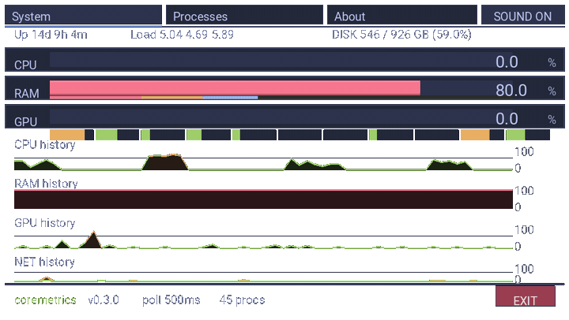
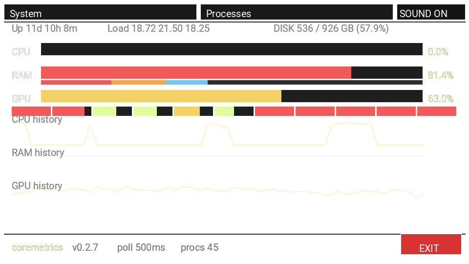
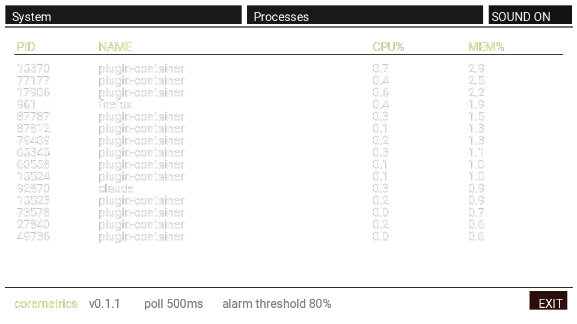
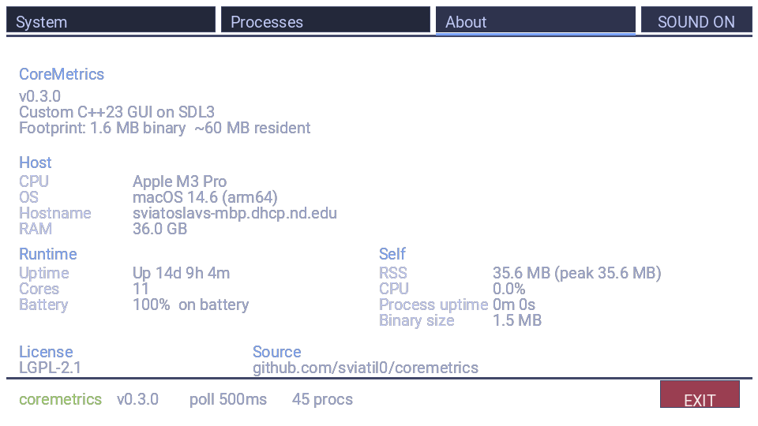
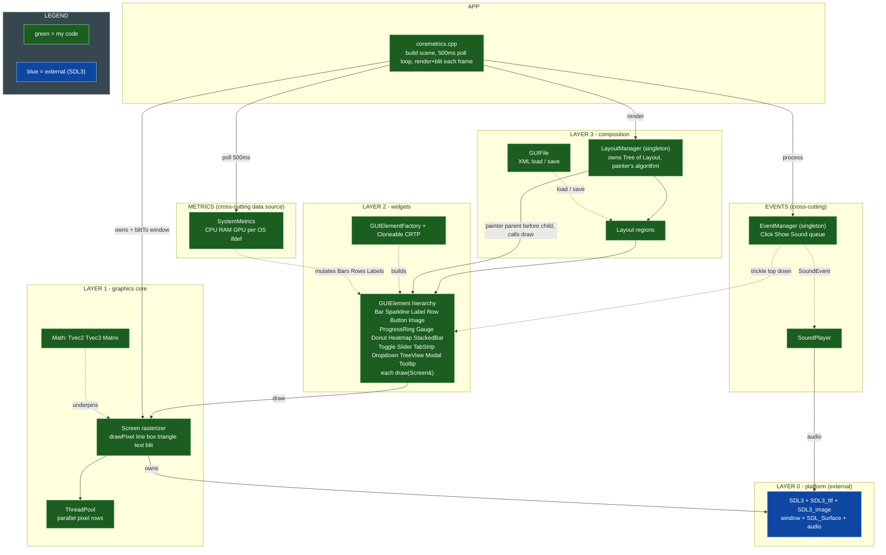
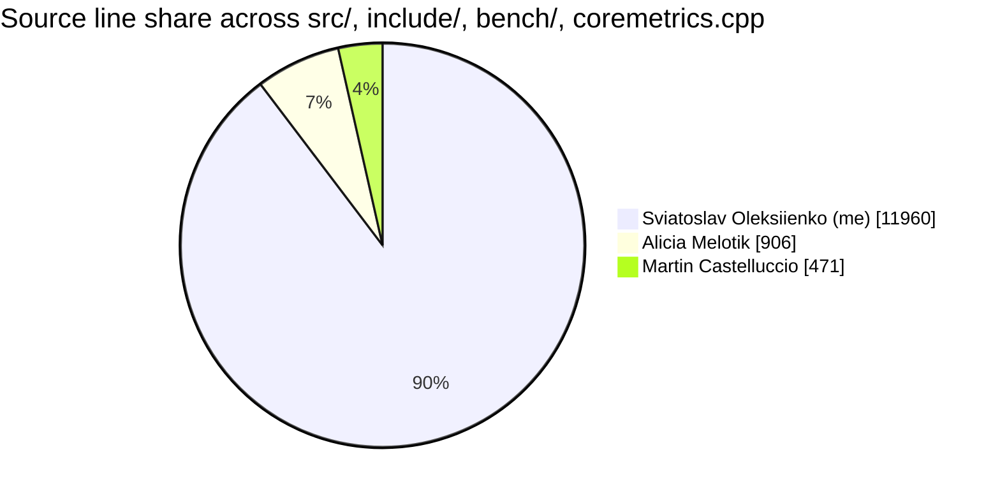

<div align="center">


# CoreMetrics

**Real-time cross-platform system monitor (CPU / RAM / GPU / processes), built on a from-scratch C++23 GUI library over raw SDL3 surfaces.**

> A from-scratch widget toolkit on raw SDL3 pixel surfaces plus three native metrics backends (`/proc`, mach + IOKit, PDH + Toolhelp) selected at compile time. 33 test suites, CI gated on Linux, macOS, and Windows. Solo-led on a 4-person team; the contribution badge above is computed live by a CI job that runs `git blame -w -C -M` on every push to `main`.

[](https://en.cppreference.com/w/cpp/23)
[](https://www.libsdl.org/)
[](#architecture)
[](LICENSE)
[](https://github.com/sviatil0/coremetrics/actions/workflows/c-cpp.yml)
[](#team-and-my-contribution)
[](https://github.com/sviatil0/coremetrics/releases/latest)
[](https://github.com/sviatil0/homebrew-coremetrics)
[](https://github.com/sviatil0/coremetrics/releases/latest)
[](https://github.com/sviatil0/coremetrics/releases)
[](https://github.com/sponsors/sviatil0)

</div>

<div align="center">



*Alternating System and Processes tabs, rendered by the binary's own headless `--screenshot` mode and stitched into the loop above. Each frame is a real CoreMetrics paint, not a mockup. Higher-fidelity `assets/coremetrics-demo.mp4` is also checked in.*

</div>

## Lightweight by design

CoreMetrics is a graphical system monitor that ships in **1.6 MB on disk** and holds **~60 MB resident** at steady state. The custom rasterizer + SDL3 surfaces strategy keeps the runtime footprint closer to a terminal tool than to a stock GUI app.

| Tool | Type | Binary | Resident RAM | Notes |
|---|---|---|---|---|
| **CoreMetrics** | **GUI** | **1.6 MB** | **~60 MB** | This project |
| Activity Monitor (macOS, builtin) | GUI | bundled | ~150-300 MB | Apple |
| iStat Menus | GUI | ~80 MB | ~80-150 MB | Paid |
| Stats (macOS, open source) | GUI | ~25 MB | ~70-120 MB | Menubar |
| Task Manager (Windows, builtin) | GUI | bundled | ~80-120 MB | Microsoft |
| btop | TUI | ~1.5 MB | ~30-50 MB | Text only |
| htop | TUI | ~200 KB | ~10-20 MB | Text only |
| Conky | desktop widget | ~500 KB | ~20-40 MB | Linux only |

Roughly **1/3 the RAM of Activity Monitor** and **1/2 of iStat Menus** at a comparable feature set, while shipping a real graphical UI rather than a terminal table. Numbers above measured on macOS arm64; the Linux and Windows builds use the same backend split and the same render path. The renderer itself is a from-scratch `Screen` class on top of raw SDL3 surfaces, no Electron, no Qt, no Skia.

| System tab | Processes tab | About tab |
|:---:|:---:|:---:|
|  |  |  |
| CPU / RAM / GPU / DISK readouts, load-colored (RAM and DISK red past 80%), per-core strip, memory breakdown segments, uptime + load average, optional sparklines | Sortable / filterable process table with PID / NAME / CPU% / MEM% / DISK I/O columns, parent-child tree view, row selection, and signal menu (TERM / KILL / INT / HUP / STOP / CONT) | Host snapshot: CPU model, OS + arch, hostname, total RAM, uptime, logical cores, battery, license, source |

> Every frame is rendered by the app itself, headlessly: `coremetrics --screenshot out.png [system|processes|about]` runs one render pass to an offscreen surface and saves it, no window required. The extension picks the writer (`.png` via `IMG_SavePNG`, anything else via `SDL_SaveBMP`).

New here? [**DOCS.md**](DOCS.md) maps the whole repo; [**API.md**](API.md) is the full public library reference (every class and method).

---

## Why this is interesting

CoreMetrics is two things in one repo: a small **GUI toolkit written directly on SDL3 pixel surfaces** (no Dear ImGui, no Qt, no game framework) and a **real system monitor built on top of it**. A few things worth a look:

Detailed comparison: [docs/COMPARISON.md](docs/COMPARISON.md).

- **htop-comparable Processes tab.** Five-column table (PID / NAME / CPU% / MEM% / DISK I/O); click any header to sort. Search and filter by name (`/`), parent-child tree view (`t`), row selection + signal menu (`k`) covering TERM / KILL / INT / HUP / STOP / CONT. System tab pairs these with per-process disk I/O backend, memory breakdown, uptime, 1/5/15-minute load averages, and a root-volume DISK readout.
- **Three native metrics backends, one header.** `SystemMetrics` reads live data from `/proc` + `/sys` on Linux, mach + IOKit on macOS, and PDH + Toolhelp on Windows, selected at compile time via `#ifdef`.
- **From-scratch UI stack.** Every widget rasterizes itself onto a raw `SDL_Surface` through one `Screen` primitive layer (`drawPixel`, Bresenham `drawLine`, `drawBox`, `drawTriangle`, `blitTo`). No retained-mode GUI library underneath; geometry is hand-rasterized, text and image decode go through SDL's debug renderer and SDL_image/SDL_ttf.
- **Event-driven, no scene rebuilds.** Clicks trickle top-down through the layout tree; tab switches drain as paired show/hide events in a single pass; metrics mutate widgets in place every 500 ms.
- **Modern C++ on purpose.** A `Cloneable<Derived>` CRTP mixin gives every widget a covariant `clone()` for free; ownership flows through `unique_ptr`; the layout tree is a generic `Tree<T>`.
- **Parallel fills.** Wide `drawBox` / `drawTriangle` operations partition pixel rows across a `ThreadPool` and join on `std::future`s per frame (a teammate's work; see the contribution table).
- **33 test suites** and a Linux + macOS + Windows GitHub Actions matrix, plus a non-blocking AddressSanitizer + UndefinedBehaviorSanitizer leg (`make asan`, `make ubsan`).

> This is a 4-person team project, and I was the lead and primary author. The "Stefan's code" badge at the top is computed by a CI job that runs `git blame -w -C -M` across `src/`, `include/`, `bench/`, and `coremetrics.cpp` on every push to `main`, so the percentage is always current and never hand-typed. See [Team and my contribution](#team-and-my-contribution) for the per-file breakdown, and `scripts/compute-contributions.sh` for the exact logic.

## Install (prebuilt)

No build toolchain required. CoreMetrics scaffolding ships to every major package manager; channels marked *(coming soon)* are wired up in `packaging/` but waiting on a one-time manual submission. See [docs/PACKAGING.md](docs/PACKAGING.md) for the full matrix.

### macOS

```bash
# Homebrew (tap)
brew tap sviatil0/coremetrics
brew install coremetrics

# MacPorts (coming soon)
sudo port install coremetrics
```

### Linux

```bash
# Debian / Ubuntu (.deb from the GitHub Release)
curl -L https://github.com/sviatil0/coremetrics/releases/latest/download/coremetrics_amd64.deb -o /tmp/coremetrics.deb
sudo apt install /tmp/coremetrics.deb

# Fedora / RHEL / openSUSE (.rpm from the GitHub Release)
sudo rpm -i https://github.com/sviatil0/coremetrics/releases/latest/download/coremetrics-x86_64.rpm

# Arch Linux (AUR, prebuilt)
yay -S coremetrics-bin

# Snap (coming soon, pending first snapcraft register)
sudo snap install coremetrics

# Flatpak / Flathub (coming soon, pending first submission)
flatpak install flathub io.github.sviatil0.coremetrics
```

### Windows

```powershell
# winget (coming soon, pending first winget-pkgs PR)
winget install sviatil0.coremetrics

# Chocolatey (coming soon, pending community.chocolatey.org moderation)
choco install coremetrics

# Scoop (coming soon, push to scoop bucket)
scoop install coremetrics
```

### Nix / NixOS

```bash
# From this repo's flake (no PR to nixpkgs yet)
nix run github:sviatil0/coremetrics?dir=packaging/nix
```

### Any platform (raw tarball / zip)

```bash
# Replace v0.2.18 with the latest release tag
curl -LO https://github.com/sviatil0/coremetrics/releases/download/v0.2.18/coremetrics-v0.2.18-macos-arm64.tar.gz
tar xf coremetrics-v0.2.18-macos-arm64.tar.gz
cd coremetrics-v0.2.18-macos-arm64
./coremetrics
```

```powershell
# Windows: download the .zip from the GitHub Release, unzip, run coremetrics.exe
```

The Homebrew formula pulls SDL3 + SDL3_ttf + SDL3_image as dependencies. The `.deb` and `.rpm` declare the equivalent runtime depends. POSIX tarballs assume SDL3 is already installed; the Windows `.zip` bundles `SDL3.dll`, `SDL3_ttf.dll`, and `SDL3_image.dll` next to the binary.

## Quickstart (from source)

Requires a **C++23 compiler** (g++ 13+ or clang 16+), GNU Make, and **SDL3 + SDL3_ttf + SDL3_image**.

```bash
# 1. clone
git clone https://github.com/sviatil0/coremetrics.git
cd coremetrics

# 2. install the SDL3 dependencies
brew install sdl3 sdl3_ttf sdl3_image          # macOS
# sudo apt install libsdl3-dev libsdl3-ttf-dev libsdl3-image-dev   # Debian/Ubuntu

# 3. build and run the demo
make                 # builds bin/coremetrics and launches it

# 4. (optional) watch the bars spike
./stress.sh          # 30s of CPU + RAM load; bars cross yellow/red thresholds

# (optional) render a frame headlessly, no window needed
./bin/coremetrics --screenshot shot.png             # System tab
./bin/coremetrics --screenshot shot.png processes   # Processes tab
./bin/coremetrics --sparklines                      # adds rolling CPU/RAM/GPU charts
./bin/coremetrics --duration 5                      # auto-quit after 5s (for CI smoke tests)
./bin/coremetrics --poll-ms 250                     # custom refresh cadence (clamped 100..10000)
./bin/coremetrics --top 10                          # headless: print top 10 procs to stdout + exit
./bin/coremetrics --top 10 --watch                  # live tail; refreshes every poll interval, ctrl-C to exit
./bin/coremetrics --top 10 --top-sort cpu           # re-order by CPU% (also: mem, io)
./bin/coremetrics --top 10 --top-color always       # ANSI threshold colors (auto by isatty)
./bin/coremetrics --help                            # show full flag reference and exit
./bin/coremetrics --version                         # print 'coremetrics X.Y.Z' and exit
```

<details>
<summary>Other build targets, Windows notes, and SDL-from-source</summary>

```bash
make coremetrics   # build + run the CoreMetrics demo (same as default)
make test          # build + run the full unit-test suite
make demo          # build + run the Milestone 005 event demo
make clean         # remove obj/ and bin/
```

```bash
./stress.sh 60 8 1024    # custom: duration(sec) cpu-workers ram-MB
```

**Windows:** download the SDL3, SDL3_ttf, and SDL3_image dev libraries from the [SDL release pages](https://github.com/libsdl-org/SDL/releases), extract them, and point `CXXFLAGS` / `LDFLAGS` in the `Makefile` at your include/lib directories.

**SDL3 not packaged yet on your distro?** Build from source:
[SDL](https://github.com/libsdl-org/SDL/releases) ·
[SDL_ttf](https://github.com/libsdl-org/SDL_ttf/releases) ·
[SDL_image](https://github.com/libsdl-org/SDL_image/releases)

Optional GPU-stress tooling: `glmark2` or `stress-ng --gpu` on Linux; on macOS the script drives a WebGL page in the browser (no install). If none are present, CPU and RAM stress still run and GPU stress is skipped with a log line.
</details>

## Architecture

The system is four layers. SDL3 hands us a window and a raw pixel surface; `Screen` turns that surface into drawing primitives; the `GUIElement` / `Layout` tree composes those primitives into a UI; and `EventManager` routes input back down the tree.

### Where to start reading

A reviewer with 5 minutes can hit the high points in this order:

1. [`coremetrics.cpp`](coremetrics.cpp): the 500 ms poll loop + render pass. Search for `pollMetrics` and `renderUptimeAndLoad` to see how data flows from `SystemMetrics` to widgets in a single pass.
2. [`src/screen.cpp`](src/screen.cpp): the rasterizer. `drawPixel`, Bresenham line, parallel `drawBox` / `drawTriangle` fills through `ThreadPool`.
3. [`src/SystemMetrics_mac.cpp`](src/SystemMetrics_mac.cpp) (or `_linux.cpp` / `_win.cpp`): one of the three native metrics backends. Same public surface, three independent implementations selected at compile time.



| Layer | Files | Responsibility |
|---|---|---|
| **Math core** | `vec2.hpp`, `vec3.hpp`, `matrix.hpp`, `linear.hpp` | Templated (int/float) vectors and a 3x3 `Matrix`; dot, cross, magnitude, unit, transpose |
| **Rasterizer** | `screen.hpp` / `screen.cpp`, `ThreadPool.hpp` | Draw primitives onto an `SDL_Surface`; parallelize wide fills |
| **Widgets** | `GUIElement.hpp`, `Cloneable.hpp`, `Bar`, `Sparkline`, `Label`, `Row`, `Button`, `Image`, plus 12 v0.3-era widgets (`ProgressRing`, `Gauge`, `Donut`, `Heatmap`, `StackedBar`, `Toggle`, `Slider`, `TabStrip`, `Dropdown`, `TreeView`, `Modal`, `Tooltip`) | Self-drawing UI elements behind one polymorphic `draw(Screen&)` interface |
| **Layout** | `Tree.hpp`, `Layout.hpp`, `LayoutManager.hpp`, `GUIFile.hpp` | Relative-coordinate layout tree, painter's-algorithm render, XML load/save |
| **Events** | `Event*.hpp`, `EventManager.hpp`, `SoundPlayer.hpp` | Queue, trickle dispatch, layout show/hide, WAV playback |
| **Metrics** | `SystemMetrics.hpp` + `SystemMetrics_{linux,mac,win}.cpp` | Live CPU / RAM / GPU / process stats per OS |
| **App** | `coremetrics.cpp` | The CoreMetrics system-monitor demo built on the above |

Per-package class diagrams (PlantUML): [Core](assets/core.png) · [GUI](assets/gui.png) · [Layout](assets/layout.png) · [Events](assets/events.png) · [Metrics](assets/metrics.png) · [combined overview](assets/overview.png).

## The demo

`coremetrics.cpp` builds a two-tab system monitor on the GUI library:

- **System tab:** CPU / RAM / GPU bars with live numeric readouts; bars recolor yellow above 60% and red above 80%. One-line status row with uptime, 1/5/15-minute load average, and root-volume disk usage (`DISK <used>/<total> GB (NN%)`, same yellow/red thresholds as RAM). Per-logical-CPU strip, htop-style active / wired / cached / free memory breakdown segments. Optional CPU / RAM / GPU sparklines with inline labels (`--sparklines`).
- **Processes tab:** PID / NAME / CPU% / MEM% / DISK I/O rows, sorted by memory by default. Click any column header to sort by that column. htop-style controls:
  - `/` to filter by case-insensitive name substring, `Esc` to clear
  - `t` to toggle parent/child tree view (or `--tree` on the command line)
  - click a row to select, `Up`/`Down` to move selection, `k` to open the signal menu (TERM / KILL / INT / HUP / STOP / CONT), `Y`/`Enter` to confirm, `N`/`Esc` to cancel
- **Footer:** live `procs N` counter shows how many processes the monitor is currently tracking.

Tab switching is event-driven: each tab button emits a hide event for the other tab and a show event for its own, both drained in one `processEvents` pass so the switch is atomic. Metrics refresh every 500 ms by default; override with `--poll-ms <N>` (clamped to the 100..10000 ms band). The main loop walks the layout tree and mutates bars, rows, and labels in place rather than rebuilding the scene.

## Status

**What works**

- GUI library, rasterizer, event system, layout tree, and the CoreMetrics demo build and run.
- Live CPU / RAM and per-process stats on macOS, Linux, and Windows.
- Total GPU usage on Linux (`gpu_busy_percent`), macOS (`IOAccelerator`), and Windows (PDH).
- 33 test suites; Linux, macOS, and Windows compile + test matrix in CI, all three legs required.

**Known limitations**

- **Per-process GPU attribution** is not exposed by the cross-platform API yet; only total GPU usage is reported. (NVIDIA NVML on Linux is a backlog item.)
- **Windows GUI is not visually verified end-to-end.** The Windows metrics layer compiles cleanly and the test suite runs green on every PR (Windows is a required CI leg as of v0.2.4), but mouse / click / tab interaction is verified on macOS and Linux only. Local cross-platform verification runs via `./run-cross-platform-tests.sh` (macOS native + Ubuntu in Docker); the Win11 ARM live-test path is `scripts/windows-arm64-smoke.ps1`.

## API reference

The math core is the most reused surface; the full per-class reference is folded below to keep this page skimmable.

| Type | Selected public API |
|---|---|
| `Tvec2<T>` / `Tvec3<T>` | `dot`, `magnitude`, `unit`, `cross` (vec3), and `==`, `+`, `-`, `*`, `+=`, `-=`, `*=`, `[]`; implicit int↔float conversion. `vec2`/`vec3` = float, `ivec2`/`ivec3` = int |
| `Matrix` | `operator*` (3x3 multiply), `operator==`, `toTranspose` |
| `Screen` | `drawPixel`, `drawLine`, `drawBox`, `drawTriangle`, `drawText`, `blitTo`, `clear` |
| `Tree<T>` | `getData`, `getParent`, `getChildren`, `addChild`, `isRoot`, `isLeaf` |
| `EventManager` | `getInstance`, `pushEvent`, `processEvents` |
| `SystemMetrics` | `readCpuPercent`, `readMemPercent`, `topProcesses(n)` |

<details>
<summary><strong>Full class-by-class reference</strong></summary>

### Math

**`Matrix`**: a 3x3 matrix of floats stored as a 2D array.
- `Matrix operator*(const Matrix&) const`: matrix multiply.
- `bool operator==(const Matrix&) const`: equality.
- `Matrix toTranspose() const`: returns the transpose.

**`Tvec2<T>`**: templated (int or float) 2-component vector. Overloads `==`, `+`, `-`, `*`, `+=`, `-=`, `*=`, `[]`, with implicit int↔float conversion.
- `T dot(const Tvec2<T>&) const`: dot product.
- `T magnitude() const`: Euclidean length for float, L1 (Manhattan) for int.
- `Tvec2<T> unit() const`: unit vector.

**`Tvec3<T>`**: templated 3-component vector with the same operator set as `Tvec2`.
- `T dot`, `T magnitude`, `Tvec3<T> unit`: as above, extended to three components.
- `Tvec3<T> cross(const Tvec3<T>&) const`: cross product.

### Rasterizer

**`Screen`**: renders geometric primitives onto an `SDL_Surface`.
- `void drawPixel(ivec2 pos, vec3 color)`: color a single pixel.
- `void drawLine(ivec2 start, ivec2 end, vec3 color)`: horizontal, vertical, or diagonal line.
- `void drawBox(ivec2 min, ivec2 max, vec3 color)`: filled rectangle.
- `void drawTriangle(ivec2 v1, ivec2 v2, ivec2 v3, vec3 color)`: filled triangle, winding-agnostic.
- `void drawText(ivec2 pos, vec3 color, std::string text)`: text via `SDL_RenderDebugText` (SDL3 built-in debug font). The bundled TTF is used by `Font::drawText`, which `Label` calls.
- `void blitTo(SDL_Surface*)`: copy the internal buffer to a display surface.

**`ThreadPool`**: singleton worker pool sized to `std::thread::hardware_concurrency`. `drawBox` / `drawTriangle` partition pixel rows across it via `submit` and join on returned futures. Copy/assign deleted; destructor signals stop and joins.
- `static ThreadPool& getInstance()`, `size_t threadCount() const`, `template<typename F> std::future<void> submit(F&&)`.

### Widgets

**`GUIElement`**: abstract base for every renderable UI component.
- `virtual void draw(Screen&) = 0`: render against a `Screen` (decoupled from the target).
- `virtual bool operator()(Event*)`: event handler; returns `true` if the event is consumed.
- `virtual GUIElement* clone() const = 0`: deep copy, supplied by `Cloneable`.

**`Cloneable<Derived>`**: CRTP mixin giving subclasses `clone()` for free.
- `GUIElement* clone() const override`: heap copy via the derived copy constructor.
- `Derived* cloneDerived() const`: covariant return, no caller cast.
- `template<typename T> std::unique_ptr<T> cloneUnique(const T&)`: wraps a clone in `unique_ptr`.

**`Point` / `Line` / `Box`**: concrete `GUIElement`s for a pixel, a segment, and a filled rectangle; each `draw` forwards to the matching `Screen` primitive.

**`GUIElementFactory`**: static factory mapping a `GUIElementType` to a concrete element.
- `createPoint`, `createLine`, `createBox`, and a generic `create(type, pos1, pos2, color)` (returns `nullptr` + logs to `std::cerr` on unknown types).

**`Label`**: text component; renders its text via the bundled font (`Font::drawText`, TTF). `draw`, `getText`, `setText`, `setPos`.

**`Selection`**: stateful checkbox (border, background, conditional check mark). `draw`, `toggle`, `isSelected`.

**`Image`**: renders a BMP by manually plotting non-transparent pixels (RGBA8888) rather than using SDL blit helpers. `draw`, `getFilePath`.

**`Button`**: clickable box with optional sound and target-layout. On a hit it pushes a `SoundEvent` and/or `ShowEvent`. `draw`, `checkToggle(x, y)`, `operator()(Event*)`.

**`Bar`**: horizontal progress bar over `[minVal, maxVal]`; recolors yellow above 60% and red above 80%; optional `metricName` tag. `setValue`, `getValue`, `getMetricName`, `draw`.

**`Row`**: horizontal strip of N text cells with caller-supplied column weights; cells truncate to width. Used for the process table. `setCells`, `getCells`, `draw`.

### Layout

**`Tree<T>`**: generic tree; each node owns `unique_ptr` children and holds a non-owning parent pointer. `getData`, `getParent`, `getChildren`, `addChild`, `isRoot`, `isLeaf`.

**`Layout`**: a screen region in relative (0.0 to 1.0) coordinates; holds a flat list of `GUIElement`s. Deep-copies its elements via `Cloneable::clone()`. `resolveAbsStart/End`, `addElement`, `setActive`, `isActive`, `getStart/End`, `getName`, `draw`.

**`LayoutManager`**: singleton owning the root `Tree<Layout>`; renders with the painter's algorithm (depth-first, parent before children). `getInstance`, `getRoot`, `addChild`, `render`.

**`GUIFile`**: loads and saves the GUI layout tree to and from a file via `readFile` / `writeFile`; the parse helpers are private.

### Events

**`Event`**: abstract message carrying an `EventType`. `getType`.
**`ClickEvent`**: carries click pixel coordinates. `getMouseX`, `getMouseY`.
**`ShowEvent`**: targets a named layout to show/hide. `getLayoutName`, `getShow`.
**`SoundEvent`**: requests WAV playback. `getFilePath`.
**`EventManager`**: singleton owning the event queue; click events trickle top-down, show events toggle a named layout, sound events delegate to `SoundPlayer`. `getInstance`, `pushEvent`, `processEvents`.
**`SoundPlayer`**: singleton WAV playback through SDL3 (44.1 kHz, mono, float32). `getInstance`, `play`.

### Metrics

**`SystemMetrics`**: static cross-platform reader; platform-agnostic header, `#ifdef`-guarded impls:
- Linux: `/proc/stat`, `/proc/meminfo`, `/proc/[pid]/{comm,stat,status}`.
- macOS: `host_statistics(64)`, `sysctl(HW_MEMSIZE)`, `proc_listpids` / `proc_pidinfo` / `proc_name`.
- Windows: `GetSystemTimes`, `GlobalMemoryStatusEx`, `CreateToolhelp32Snapshot` + `GetProcessMemoryInfo` / `GetProcessTimes`.
- `static float readCpuPercent()` (first call returns `0.0f`, no baseline), `static float readMemPercent()`, `static std::vector<ProcessInfo> topProcesses(std::size_t n = 20)`.

</details>

<!-- contribution:start -->

## Team and my contribution

A 4-person Notre Dame CSE 40232 software-engineering project (SP26 Team 04), three months, a PR-template + required-review workflow with per-developer branches. I was the lead and primary author: **89.7% of the source by line** (git-blame verified, recomputed on every push to `main`).

_The block below is regenerated by [`scripts/compute-contributions.sh`](scripts/compute-contributions.sh) on every push to `main` via the `Contribution badge` workflow. Don't edit between the markers — your edit will be overwritten._

### Lines of code by author



| Author | Lines | Share |
| --- | ---: | ---: |
| **Sviatoslav Oleksiienko (me)** | 11960 | `██████████████████░░` 89.7% |
| Alicia Melotik | 906 | `█░░░░░░░░░░░░░░░░░░░` 6.8% |
| Martin Castelluccio | 471 | `█░░░░░░░░░░░░░░░░░░░` 3.5% |

_Run \`scripts/compute-contributions.sh\` locally to reproduce these numbers from your checkout._

<!-- contribution:end -->

### Who owned what

| Contributor | What they owned |
|---|---|
| **Sviatoslav (me)** | All three `SystemMetrics` platform backends (`/proc`, IOKit, PDH), the event system, the GUI element hierarchy and factory, the `Layout` / `LayoutManager` tree, the Bresenham line rasterizer (`plotLineLow` / `plotLineHigh`) plus `blitTo` / `clear`, the CoreMetrics demo app, the test suites, CI, and tooling. After v0.1.0: `ProcParsers`, `ProcessUtils` helpers, `RingBuffer<T>` + `Sparkline`, `AssetPath` resolver, lifecycle (`--duration`, signal handlers), benchmark, the release pipeline, the Homebrew tap. |
| **Alicia Melotik** | The XML parser and `GUIFile`, the `Cloneable` / CRTP clone path, `drawPixel` / `drawLine` / `drawText` entry points, Windows GPU, layout helpers. |
| **Martin Castelluccio** | The `ThreadPool` and the parallel fills in `drawBox` / `drawTriangle`, plus `Button` event handling. |
| **Daniel Rehberg** (instructor) | Early scaffolding and review. |

`screen.cpp` is shared (line-drawing + blit + Bresenham are mine, the box/triangle parallel fills are Martin's, the pixel/line/text entry points are Alicia's).

Reproduce the live split yourself:

```sh
bash scripts/compute-contributions.sh
cat .github/badges/contribution.json
cat .github/badges/contributions.md
```

Code review caught real bugs before merge (for example a strict-weak-ordering crash in the process sort, and the `utime+stime` off-by-one in the Linux per-process CPU% parser). Released publicly with the team's and instructor's consent under LGPL-2.1.

## Contributing

Coding standards (Allman braces, `#ifndef` guards, no lambdas except inside `ThreadPool::submit`, no exceptions, camelCase, no magic numbers) and the PR/review process are documented in the collapsible below; fill out [`PULL_REQUEST_TEMPLATE.md`](PULL_REQUEST_TEMPLATE.md) for every PR.

<details>
<summary>Coding standards and team process</summary>

**Design and architecture**
- Keep non-public helpers private; avoid code smells.
- Header guards via `#ifndef`, not `#pragma once`.
- No exceptions or assertions; handle every corner case and log to `std::cerr` instead of crashing.
- No `print` statements in production code; mark file-local functions `static`.
- No lambda functions.

**SDL3**
- Link SDL3 dynamically; do not compile it into source.
- SDL3 sits between Layer 1 (window + GPU pixel output) and Layer 2 (UI layout and interaction).

**Style**

| Category | Convention |
|---|---|
| Variables, free functions | camelCase |
| Class names | PascalCase |
| Vector aliases | `vecX`, `ivecX` |
| Constants | CAPITALIZED_SNAKE_CASE |
| Magic numbers | Not allowed; use `const` / `constexpr` |
| Indentation | Allman style |
| Control one-liners | Not allowed; always full braces |

```cpp
// not allowed
if (x) doSomething();

// required (Allman)
if (x)
{
    doSomething();
}
```

**UML diagrams** are PlantUML, compiled by `compile-uml.sh`: `-` private, `+` public, `name: type` fields, a dividing line between fields and methods.

**Team process**
- Every PR uses the template and gets a written review before merge.
- Trello flow: Backlog -> Active (assigned) -> Review (PR). Address corrections, re-review, then the reviewer merges. The team reviews all changes together at each milestone.
- Run the full test suite locally before pushing.
</details>

## License

[LGPL-2.1](LICENSE). Team project, released with the team's and instructor's consent.