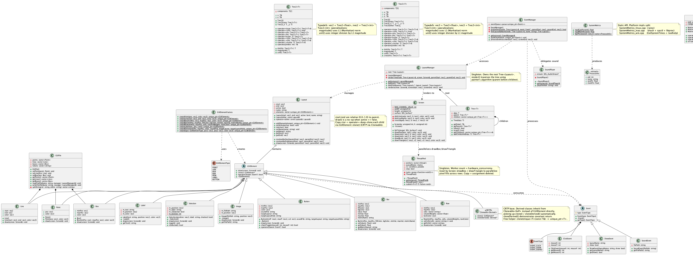

# SP26_Team04

## Class Diagram


---

## Global Requirements

### Design and Architecture

- Avoid code smell. A code smell is a noticeable pattern in source code that suggests an underlying design or maintainability problem, even though the code still works correctly.
- If you require additional functions to complete a task that are not part of the public-facing requirement, do not make them public.
- Do not use `#pragma once` — use `#ifndef` header guards instead.
- No exceptions or assertions. Print to `std::cerr` with a helpful message, but all corner cases must be handled without crashing the app.
- No print statements in production code.
- Static functions signal that a function is unique to its source file and cannot conflict with identically named functions in other translation units.
- Do not use lambda functions.

### SDL3

- Link SDL3 dynamically — do not compile it into your source code.
- SDL3 provides cross-platform access to the window manager, which sits between two layers:
  - **Layer 1 (hardware/rendering):** Gets a window and talks to the GPU to draw pixels on screen.
  - **Layer 2 (GUI/layout):** Arranges and styles UI elements (buttons, text, etc.) and handles user interaction.
- Vertex buffer layout: all attributes (position, color, UV, etc.) are packed into one buffer. The **stride** is how many bytes to jump to get from one vertex to the next. The **offset** for each attribute is where inside each vertex's bytes that attribute starts.

### Style

| Category | Convention |
|---|---|
| Variable names | camelCase |
| Free functions | camelCase |
| Class names | PascalCase |
| Exceptions | `vecX`, `ivecX` |
| Constants | CAPITALIZED_SNAKE_CASE |
| Magic numbers | Not allowed — use `const` or `constexpr` |
| Indentation | Allman style |
| Comments | Only to explain esoteric code (none expected) |
| Control block one-liners | Not allowed — always use full braces |

One-liner example — **not allowed:**
```cpp
if (x) doSomething();
for (...) doSomething();
```
Required form (Allman style — opening brace on its own line):
```cpp
if (x)
{
    doSomething();
}
for (...)
{
    doSomething();
}
```

### UML Diagram Style

Diagrams are written in [PlantUML](https://plantuml.com/) and compiled using `compile-uml.sh`.

- `-` prefix for private members
- `+` prefix for public members
- Field members written as `name: type`
- Fields separated from methods by a dividing line

---

## Internal Team Rules

- Fill out the pull request template for every PR, specifying the changes made.
- Every pull request must be reviewed by a team member who provides written feedback or corrections.
- Trello workflow: **Backlog** → **Active** (assign a person) → **Review** (when ready for PR). If corrections are requested, implement them and move back to review. Once approved, the reviewer merges. At every milestone end, the team reviews all changes together.
- Run the full test suite locally before pushing code.

---

# main.cpp
## Description
main.cpp is a demonstration program that utilizes the Screen and GUIFile classes to load, display, and save GUI elements.


# Matrix
## Description
Class description

## Methods
### return identifier(parameter list)
Description of method

etc..

# vec2
## Description
Class description

## Methods
### return identifier(parameter list)
Description of method

etc..

# vec3
## Description
Class description

## Methods
### return identifier(parameter list)
Description of methods

etc..

# Screen
## Description
The Screen class provides an interface for rendering geometric primitives onto an SDL surface.

## Methods
### void drawPixel(ivec2 pos, vec3 color)
Colors a single pixel at the specified integer coordinate.

### void drawLine(ivec2 start, ivec2 end, vec3 color)
Renders a line between two points. This method handles horizontal, vertical, and diagonal orientations.

### void drawBox(ivec2 minPos, ivec2 maxPos, vec3 color)
Renders a rectangle between the specified minimum and maximum corners.

### void blitTo(SDL_Surface* surface)
Copies the internal Screen buffer to the provided SDL surface for display.

### void drawTriange(ivec2 vert1, ivec2 vert2, ivec2 vert3, vec3 color)
Renders a triangle using the three vertices using their cross vectors. It is filled in with color, and the vertices can be given in clockwise or counter-clockwise direction.

# GUIFile
## Description
The GUIFile class manages the loading, staging, and saving of GUI layout elements. It acts as the bridge between the internal data structures and the external XML file format.

## Containers
* **std::vector<Point>**: Stores individual point elements parsed from XML or staged for saving.
* **std::vector<Line>**: Stores line elements, including start/end positions and color data.
* **std::vector<Box>**: Stores box elements, including min/max bounds and color data.
* **Selection Logic**: Vectors provide contiguous memory for fast iteration during rendering and writing. To optimize for mobile use and memory efficiency, all containers are cleared before loading new data from a file.

## Methods
### void setPoint(Point point)
Adds a Point object to the internal container, staging it for a file write operation.

### void setLine(Line line)
Adds a Line object to the internal container, staging it for a file write operation.

### void setBox(Box box)
Adds a Box object to the internal container, staging it for a file write operation.

### std::vector<Point> getPoints()
Returns a copy of the internal points vector. Returning by value ensures the class's internal data cannot be modified by the caller.

### std::vector<Line> getLines()
Returns a copy of the internal lines vector to provide read-only access to staged data.

### std::vector<Box> getBoxes()
Returns a copy of the internal boxes vector to provide read-only access to staged data.

### splitString(const std::string &str, const std::string &delim)
This method takes in a string to split and a set of delimiters as a string to split it by. A string vector stores the substrings. Once the find method does not find anymore delimiters, the method returns the populated vector with the separated tokens.

### void readFile(std::string fileName)
Parses a specified XML file into GUI elements. The method clears all internal containers before parsing to ensure no data overlap.

### void writeFile(std::string fileName)
Writes currently staged elements to an XML file. The output follows a strict schema where nested tags are indented and value tags (like <x>) are on a single line for human readability.

# GUIElement
## Description
An abstract base class (ABC) that serves as the foundation for all renderable UI components. It enforces a polymorphic interface, ensuring that any UI component can be drawn using a provided `Screen` reference without the caller needing to know the specific type of the element.

## Methods
### virtual void draw(Screen& screen) = 0
A pure virtual method that subclasses must implement. By receiving a `Screen` reference as a parameter, the element remains decoupled from the specific rendering target, allowing for better memory efficiency and flexibility.

# Point
## Description
A concrete GUIElement that represents a single colored pixel. Stores a 2D position and a color.

## Methods
### void draw(Screen& screen) override
Plots a single pixel at the stored position using the stored color via `Screen::drawPixel`.

# Line
## Description
A concrete GUIElement that represents a colored line segment between two 2D positions.

## Methods
### void draw(Screen& screen) override
Draws a line between the stored start and end positions using the stored color via `Screen::drawLine`.

# Box
## Description
A concrete GUIElement that represents a filled colored rectangle defined by two corner positions.

## Methods
### void draw(Screen& screen) override
Draws a filled rectangle between the stored minimum and maximum positions using the stored color via `Screen::drawBox`.

# GUIElementFactory
## Description
A static factory class that centralizes the creation of GUIElement subclasses. It maps a `GUIElementType` enum value to the appropriate concrete element, keeping all construction logic in one place and decoupling the caller from specific subclass constructors.

## Methods
### static GUIElement* createPoint(vec2 pos, vec3 color)
Creates and returns a heap-allocated `Point` with the given position and color.

### static GUIElement* createLine(vec2 start, vec2 end, vec3 color)
Creates and returns a heap-allocated `Line` with the given start position, end position, and color.

### static GUIElement* createBox(vec2 minPos, vec2 maxPos, vec3 color)
Creates and returns a heap-allocated `Box` with the given corner positions and color.

### static GUIElement* create(GUIElementType type, vec2 pos1, vec2 pos2, vec3 color)
Generic entry point for runtime element creation, for use when the element type is determined at runtime (e.g. XML parsing). `pos2` is ignored for `POINT`. Prints to `std::cerr` and returns `nullptr` for unknown types.

# Tree
## Description
A generic templated tree data structure. Each node holds a value of type `T`, a non-owning raw pointer to its parent, and owning `unique_ptr` children. Because it is a template, the full implementation lives in the header.

## Methods
### T& getData()
Returns a reference to the value stored in this node.

### Tree<T>* getParent()
Returns a raw pointer to the parent node, or `nullptr` if this node is the root.

### bool isRoot() const
Returns true if this node has no parent.

### bool isLeaf() const
Returns true if this node has no children.

### std::vector<std::unique_ptr<Tree<T>>>& getChildren()
Returns a reference to the vector of child nodes.

### Tree<T>* addChild(T childData)
Constructs a new child node from the given value, appends it to the children vector, sets its parent pointer to this node, and returns a raw pointer to the new child.

# Layout
## Description
Represents a rectangular region of the screen defined by relative coordinates (0.0–1.0) within its parent region. Layouts form a tree hierarchy managed by `LayoutManager`. Each layout holds a flat list of `GUIElement` objects that are drawn when the layout is active. The painter's algorithm is handled externally by `LayoutManager::render`, which traverses the tree and draws parent layouts before children.

## Methods
### ivec2 resolveAbsStart(ivec2 parentStart, ivec2 parentEnd) const
Converts the layout's relative `start` (0.0–1.0) to an absolute pixel coordinate by interpolating within the parent's pixel bounds: `parentStart + start * (parentEnd - parentStart)`.

### ivec2 resolveAbsEnd(ivec2 parentStart, ivec2 parentEnd) const
Converts the layout's relative `end` (0.0–1.0) to an absolute pixel coordinate using the same interpolation as `resolveAbsStart`.

### void addElement(std::unique_ptr<GUIElement> element)
Appends a GUIElement to the layout's internal list. The layout takes ownership via unique_ptr.

### void setActive(bool active)
Sets the active state. When inactive, the layout skips rendering entirely.

### bool isActive() const
Returns the current active state.

### vec2 getStart() const
Returns the layout's relative start coordinate (0.0–1.0).

### vec2 getEnd() const
Returns the layout's relative end coordinate (0.0–1.0).

### void draw(Screen& screen, ivec2 parentStart, ivec2 parentEnd) const
Draws all elements in the layout. Returns immediately if the layout is inactive. Resolves the layout's absolute bounds from the parent bounds, then calls `draw(screen)` on each contained `GUIElement`.

# LayoutManager
## Description
A singleton that owns the root `Tree<Layout>` and manages the full layout hierarchy. It centralizes tree construction and rendering so that `main.cpp` only needs to call `getInstance()`, populate layouts, and call `render()` each frame.

## Methods
### static LayoutManager& getInstance()
Returns the single global instance.

### Tree<Layout>& getRoot()
Returns a reference to the root layout node.

### Tree<Layout>* addChild(Tree<Layout>* parent, Layout layout)
Adds a new child layout under the given parent node and returns a pointer to the new node.

### void render(Screen& screen, ivec2 screenStart, ivec2 screenEnd) const
Traverses the layout tree using the painter's algorithm (depth-first, parent before children) and calls `draw` on each active layout, passing the resolved absolute bounds down the call stack.

# Label
## Description
A UI component responsible for managing and displaying text strings. It currently utilizes a "placeholder" system that renders a proportional box for each character to verify layout, spacing, and color before a full font engine is integrated.

## Methods
### void draw(Screen& screen) override
Iterates through the stored string and calculates the screen coordinates for each character, rendering a filled box via the screen's `drawBox` method to represent the text footprint.

### std::string getText() const
Returns the string content currently assigned to the label.

# Selection
## Description
A stateful checkbox component used for user input. It manages a boolean selection state and provides a multi-layered visual representation including a border, a background, and a conditional "check" mark.

## Methods
### void draw(Screen& screen) override
Renders the checkbox components. It draws a white border and dark background. If the internal state is set to true, it renders a green internal mark to indicate the "selected" status.

### void toggle()
Inverts the current selection state (flips between true and false).

### bool isSelected() const
Returns the current boolean value of the checkbox state.

# Image
## Description
A component designed to render bitmap (BMP) assets. Following a "reductionist" approach, this class avoids high-level SDL blitting functions and instead manually iterates through raw pixel buffers to plot images coordinate-by-coordinate.

## Methods
### void draw(Screen& screen) override
Loads a BMP file into a temporary buffer, converts it to a standard RGBA8888 format, and executes a nested loop to plot every non-transparent pixel to the screen using `drawPixel`.

### std::string getFilePath() const
Returns the file path of the image asset associated with this object.


# Button
## Description
A component designed to render a box which recognizes when it is clicked. 

## Methods
### void draw(Screen& screen) override
Using the screen class'`drawBox` function, draws a box between the button's min and max boundaries, filled in with the given color and a one pixel thick white border.

### bool checkToggle(int mouseX, int mouseY)
Checks if the mouse coordinates are within the bounds of the button component.
