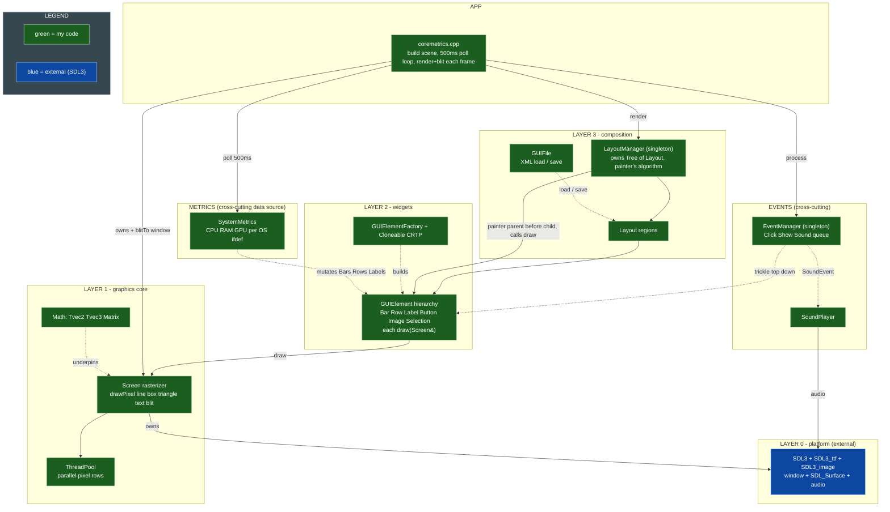
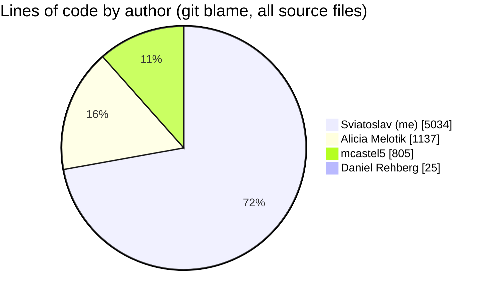

<div align="center">


# CoreMetrics

**Real-time cross-platform system monitor (CPU / RAM / GPU / processes), built on a from-scratch C++23 GUI library over raw SDL3 surfaces.**

[](https://en.cppreference.com/w/cpp/23)
[](https://www.libsdl.org/)
[](#architecture)
[](LICENSE)
[](https://github.com/sviatil0/coremetrics/actions/workflows/c-cpp.yml)

</div>

| System tab | Processes tab |
|:---:|:---:|
|  |  |
| CPU / RAM / GPU bars, load-colored (RAM red past 80%) | Sortable PID / NAME / CPU% / MEM% table |

> Both frames are rendered by the app itself, headlessly: `coremetrics --screenshot out.bmp [system|processes]` runs one render pass to an offscreen surface and saves it, no window required.

New here? [**DOCS.md**](DOCS.md) maps the whole repo; [**API.md**](API.md) is the full public library reference (every class and method).

---

## Why this is interesting

CoreMetrics is two things in one repo: a small **GUI toolkit written directly on SDL3 pixel surfaces** (no Dear ImGui, no Qt, no game framework) and a **real system monitor built on top of it**. A few things worth a look:

- **From-scratch UI stack.** Every widget rasterizes itself onto a raw `SDL_Surface` through one `Screen` primitive layer (`drawPixel` / `drawLine` / `drawBox` / `drawTriangle` / `drawText`). No retained-mode GUI library underneath.
- **Three native metrics backends, one header.** `SystemMetrics` reads live data from `/proc` + `/sys` on Linux, mach + IOKit on macOS, and PDH + Toolhelp on Windows, selected at compile time via `#ifdef`.
- **Parallel fills.** Wide `drawBox` / `drawTriangle` operations partition pixel rows across a `ThreadPool` and join on `std::future`s per frame.
- **Modern C++ on purpose.** A `Cloneable<Derived>` CRTP mixin gives every widget a covariant `clone()` for free; ownership flows through `unique_ptr`; the layout tree is a generic `Tree<T>`.
- **Event-driven, no scene rebuilds.** Clicks trickle top-down through the layout tree; tab switches drain as paired show/hide events in a single pass; metrics mutate widgets in place every 500 ms.
- **175 unit tests across 13 suites** and a 3-OS GitHub Actions matrix.

> This is a 4-person team project, and I was the lead and primary author: **~72% of the source by line** (git-blame verified, 5,034 of 7,001). See [Team and my contribution](#team-and-my-contribution) for the per-file breakdown.

## Quickstart

Requires a **C++23 compiler** (g++ 13+ or clang 16+), GNU Make, and **SDL3 + SDL3_ttf + SDL3_image**.

```bash
# 1. clone
git clone https://github.com/sviatil0/coremetrics.git
cd coremetrics

# 2. install the SDL3 dependencies
brew install sdl3 sdl3_ttf sdl3_image          # macOS
# sudo apt install libsdl3-dev libsdl3-ttf-dev libsdl3-image-dev   # Debian/Ubuntu

# 3. build and run the demo
make                 # builds bin/coremetrics and launches it

# 4. (optional) watch the bars spike
./stress.sh          # 30s of CPU + RAM load; bars cross yellow/red thresholds

# (optional) render a frame headlessly, no window needed
./bin/coremetrics --screenshot shot.bmp
```

<details>
<summary>Other build targets, Windows notes, and SDL-from-source</summary>

```bash
make coremetrics   # build + run the CoreMetrics demo (same as default)
make test          # build + run the full unit-test suite
make demo          # build + run the Milestone 005 event demo
make clean         # remove obj/ and bin/
```

```bash
./stress.sh 60 8 1024    # custom: duration(sec) cpu-workers ram-MB
```

**Windows:** download the SDL3, SDL3_ttf, and SDL3_image dev libraries from the [SDL release pages](https://github.com/libsdl-org/SDL/releases), extract them, and point `CXXFLAGS` / `LDFLAGS` in the `Makefile` at your include/lib directories.

**SDL3 not packaged yet on your distro?** Build from source:
[SDL](https://github.com/libsdl-org/SDL/releases) ·
[SDL_ttf](https://github.com/libsdl-org/SDL_ttf/releases) ·
[SDL_image](https://github.com/libsdl-org/SDL_image/releases)

Optional GPU-stress tooling: `glmark2` or `stress-ng --gpu` on Linux; on macOS the script drives a WebGL page in the browser (no install). If none are present, CPU and RAM stress still run and GPU stress is skipped with a log line.
</details>

## Architecture

The system is four layers. SDL3 hands us a window and a raw pixel surface; `Screen` turns that surface into drawing primitives; the `GUIElement` / `Layout` tree composes those primitives into a UI; and `EventManager` routes input back down the tree.



| Layer | Files | Responsibility |
|---|---|---|
| **Math core** | `vec2.hpp`, `vec3.hpp`, `matrix.hpp`, `linear.hpp` | Templated (int/float) vectors and a 3x3 `Matrix`; dot, cross, magnitude, unit, transpose |
| **Rasterizer** | `screen.hpp` / `screen.cpp`, `ThreadPool.hpp` | Draw primitives onto an `SDL_Surface`; parallelize wide fills |
| **Widgets** | `GUIElement.hpp`, `Cloneable.hpp`, `Bar`, `Row`, `Label`, `Button`, `Image`, `selection` | Self-drawing UI elements behind one polymorphic `draw(Screen&)` interface |
| **Layout** | `Tree.hpp`, `Layout.hpp`, `LayoutManager.hpp`, `GUIFile.hpp` | Relative-coordinate layout tree, painter's-algorithm render, XML load/save |
| **Events** | `Event*.hpp`, `EventManager.hpp`, `SoundPlayer.hpp` | Queue, trickle dispatch, layout show/hide, WAV playback |
| **Metrics** | `SystemMetrics.hpp` + `SystemMetrics_{linux,mac,win}.cpp` | Live CPU / RAM / GPU / process stats per OS |
| **App** | `coremetrics.cpp` | The CoreMetrics system-monitor demo built on the above |

Per-package class diagrams (PlantUML): [Core](assets/core.png) · [GUI](assets/gui.png) · [Layout](assets/layout.png) · [Events](assets/events.png) · [Metrics](assets/metrics.png) · [combined overview](assets/overview.png).

## The demo

`coremetrics.cpp` builds a two-tab system monitor on the GUI library:

- **System tab:** CPU and RAM bars with live numeric readouts. Bars recolor yellow above 60% and red above 80% to flag load at a glance.
- **Processes tab:** a header row plus configurable data rows listing PID / NAME / CPU% / MEM%, sorted by memory usage.

Tab switching is event-driven: each tab button emits a hide event for the other tab and a show event for its own, both drained in one `processEvents` pass so the switch is atomic. Metrics refresh every 500 ms; the main loop walks the layout tree and mutates bars, rows, and labels in place rather than rebuilding the scene.

## Status

**What works**

- GUI library, rasterizer, event system, layout tree, and the CoreMetrics demo build and run.
- Live CPU / RAM and per-process stats on macOS, Linux, and Windows.
- Total GPU usage on Linux (`gpu_busy_percent`), macOS (`IOAccelerator`), and Windows (PDH).
- 175 unit tests across 13 suites; full 3-OS compile + test matrix in CI.

**Known limitations**

- **Per-process GPU attribution** is not exposed by the cross-platform API yet; only total GPU usage is reported. (NVIDIA NVML on Linux is a backlog item.)
- **Windows GUI is not visually verified end-to-end.** The Windows metrics layer exists, but mouse/click/tab interaction is verified on macOS and Linux only, so CI is gated on Linux + macOS (the Windows SDL3 + pkg-config toolchain on the runner is also flaky). Local cross-platform verification runs via `./run-cross-platform-tests.sh` (macOS native + Ubuntu in Docker).

## API reference

The math core is the most reused surface; the full per-class reference is folded below to keep this page skimmable.

| Type | Selected public API |
|---|---|
| `Tvec2<T>` / `Tvec3<T>` | `dot`, `magnitude`, `unit`, `cross` (vec3), and `==`, `+`, `-`, `*`, `+=`, `-=`, `*=`, `[]`; implicit int↔float conversion. `vec2`/`vec3` = float, `ivec2`/`ivec3` = int |
| `Matrix` | `operator*` (3x3 multiply), `operator==`, `toTranspose` |
| `Screen` | `drawPixel`, `drawLine`, `drawBox`, `drawTriangle`, `drawText`, `blitTo`, `clear` |
| `Tree<T>` | `getData`, `getParent`, `getChildren`, `addChild`, `isRoot`, `isLeaf` |
| `EventManager` | `getInstance`, `pushEvent`, `processEvents` |
| `SystemMetrics` | `readCpuPercent`, `readMemPercent`, `topProcesses(n)` |

<details>
<summary><strong>Full class-by-class reference</strong></summary>

### Math

**`Matrix`**: a 3x3 matrix of floats stored as a 2D array.
- `Matrix operator*(const Matrix&) const`: matrix multiply.
- `bool operator==(const Matrix&) const`: equality.
- `Matrix toTranspose() const`: returns the transpose.

**`Tvec2<T>`**: templated (int or float) 2-component vector. Overloads `==`, `+`, `-`, `*`, `+=`, `-=`, `*=`, `[]`, with implicit int↔float conversion.
- `T dot(const Tvec2<T>&) const`: dot product.
- `T magnitude() const`: Euclidean length for float, L1 (Manhattan) for int.
- `Tvec2<T> unit() const`: unit vector.

**`Tvec3<T>`**: templated 3-component vector with the same operator set as `Tvec2`.
- `T dot`, `T magnitude`, `Tvec3<T> unit`: as above, extended to three components.
- `Tvec3<T> cross(const Tvec3<T>&) const`: cross product.

### Rasterizer

**`Screen`**: renders geometric primitives onto an `SDL_Surface`.
- `void drawPixel(ivec2 pos, vec3 color)`: color a single pixel.
- `void drawLine(ivec2 start, ivec2 end, vec3 color)`: horizontal, vertical, or diagonal line.
- `void drawBox(ivec2 min, ivec2 max, vec3 color)`: filled rectangle.
- `void drawTriangle(ivec2 v1, ivec2 v2, ivec2 v3, vec3 color)`: filled triangle, winding-agnostic.
- `void drawText(ivec2 pos, vec3 color, std::string text)`: text via the bundled font.
- `void blitTo(SDL_Surface*)`: copy the internal buffer to a display surface.

**`ThreadPool`**: singleton worker pool sized to `std::thread::hardware_concurrency`. `drawBox` / `drawTriangle` partition pixel rows across it via `submit` and join on returned futures. Copy/assign deleted; destructor signals stop and joins.
- `static ThreadPool& getInstance()`, `size_t threadCount() const`, `template<typename F> std::future<void> submit(F&&)`.

### Widgets

**`GUIElement`**: abstract base for every renderable UI component.
- `virtual void draw(Screen&) = 0`: render against a `Screen` (decoupled from the target).
- `virtual bool operator()(Event*)`: event handler; returns `true` if the event is consumed.
- `virtual GUIElement* clone() const = 0`: deep copy, supplied by `Cloneable`.

**`Cloneable<Derived>`**: CRTP mixin giving subclasses `clone()` for free.
- `GUIElement* clone() const override`: heap copy via the derived copy constructor.
- `Derived* cloneDerived() const`: covariant return, no caller cast.
- `template<typename T> std::unique_ptr<T> cloneUnique(const T&)`: wraps a clone in `unique_ptr`.

**`Point` / `Line` / `Box`**: concrete `GUIElement`s for a pixel, a segment, and a filled rectangle; each `draw` forwards to the matching `Screen` primitive.

**`GUIElementFactory`**: static factory mapping a `GUIElementType` to a concrete element.
- `createPoint`, `createLine`, `createBox`, and a generic `create(type, pos1, pos2, color)` (returns `nullptr` + logs to `std::cerr` on unknown types).

**`Label`**: text component; currently renders a proportional box per character as a layout placeholder ahead of a full font engine. `draw`, `getText`.

**`Selection`**: stateful checkbox (border, background, conditional check mark). `draw`, `toggle`, `isSelected`.

**`Image`**: renders a BMP by manually plotting non-transparent pixels (RGBA8888) rather than using SDL blit helpers. `draw`, `getFilePath`.

**`Button`**: clickable box with optional sound and target-layout. On a hit it pushes a `SoundEvent` and/or `ShowEvent`. `draw`, `checkToggle(x, y)`, `operator()(Event*)`.

**`Bar`**: horizontal progress bar over `[minVal, maxVal]`; recolors yellow above 60% and red above 80%; optional `metricName` tag. `setValue`, `getValue`, `getMetricName`, `draw`.

**`Row`**: horizontal strip of N text cells with caller-supplied column weights; cells truncate to width. Used for the process table. `setCells`, `getCells`, `draw`.

### Layout

**`Tree<T>`**: generic tree; each node owns `unique_ptr` children and holds a non-owning parent pointer. `getData`, `getParent`, `getChildren`, `addChild`, `isRoot`, `isLeaf`.

**`Layout`**: a screen region in relative (0.0 to 1.0) coordinates; holds a flat list of `GUIElement`s. Deep-copies its elements via `Cloneable::clone()`. `resolveAbsStart/End`, `addElement`, `setActive`, `isActive`, `getStart/End`, `getName`, `draw`.

**`LayoutManager`**: singleton owning the root `Tree<Layout>`; renders with the painter's algorithm (depth-first, parent before children). `getInstance`, `getRoot`, `addChild`, `render`.

**`GUIFile`**: loads/stages/saves GUI layout elements to/from XML. Holds `std::vector<Point/Line/Box>`; clears containers before each load. `setPoint/Line/Box`, `getPoints/Lines/Boxes`, `readFile`, `writeFile`.

### Events

**`Event`**: abstract message carrying an `EventType`. `getType`.
**`ClickEvent`**: carries click pixel coordinates. `getMouseX`, `getMouseY`.
**`ShowEvent`**: targets a named layout to show/hide. `getLayoutName`, `getShow`.
**`SoundEvent`**: requests WAV playback. `getFilePath`.
**`EventManager`**: singleton owning the event queue; click events trickle top-down, show events toggle a named layout, sound events delegate to `SoundPlayer`. `getInstance`, `pushEvent`, `processEvents`.
**`SoundPlayer`**: singleton WAV playback through SDL3 (44.1 kHz, mono, float32). `getInstance`, `play`.

### Metrics

**`SystemMetrics`**: static cross-platform reader; platform-agnostic header, `#ifdef`-guarded impls:
- Linux: `/proc/stat`, `/proc/meminfo`, `/proc/[pid]/{comm,stat,status}`.
- macOS: `host_statistics(64)`, `sysctl(HW_MEMSIZE)`, `proc_listpids` / `proc_pidinfo` / `proc_name`.
- Windows: `GetSystemTimes`, `GlobalMemoryStatusEx`, `CreateToolhelp32Snapshot` + `GetProcessMemoryInfo` / `GetProcessTimes`.
- `static float readCpuPercent()` (first call returns `0.0f`, no baseline), `static float readMemPercent()`, `static std::vector<ProcessInfo> topProcesses(std::size_t n = 20)`.

</details>

## Team and my contribution



```
me            ████████████████████████████████████░░░░░░░░░░░░  72%   (5,034 lines)
Alicia        ████████░░░░░░░░░░░░░░░░░░░░░░░░░░░░░░░░░░░░░░░░░░  16%   (1,137 lines)
mcastel5      ██████░░░░░░░░░░░░░░░░░░░░░░░░░░░░░░░░░░░░░░░░░░░░  12%   (  805 lines)
```

| Contributor | What they owned |
|---|---|
| **Sviatoslav (me)** | The graphics core (vector/matrix math, the `Screen` rasterizer and its pixel tests), the event system, the GUI element hierarchy and factory, all three `SystemMetrics` platform backends, the demo app, CI, and tooling. The `ThreadPool` and `Cloneable` are teammates'; I wrote the rasterizer code that uses them. |
| **Alicia Melotik** | The XML parser and `GUIFile`, the `Cloneable` / CRTP clone path, Windows GPU, layout helpers. |
| **Martin Castellanos** | `Layout` core methods, the `Button` event functor, the `ThreadPool`, drawing parallelism. |
| **Daniel Rehberg** (instructor) | Early scaffolding and review. |

Reproduce the split yourself:

```sh
git ls-files '*.cpp' '*.hpp' '*.h' | while read f; do
  git blame --line-porcelain "$f"; done | grep '^author ' | sort | uniq -c | sort -rn
```

Code review caught real bugs before merge (for example a strict-weak-ordering crash in the process sort). Released publicly with the team's and instructor's consent under LGPL-2.1.

## Contributing

Coding standards (Allman braces, `#ifndef` guards, no lambdas, no exceptions, camelCase, no magic numbers) and the PR/review process are documented in the collapsible below; fill out [`PULL_REQUEST_TEMPLATE.md`](PULL_REQUEST_TEMPLATE.md) for every PR.

<details>
<summary>Coding standards and team process</summary>

**Design and architecture**
- Keep non-public helpers private; avoid code smells.
- Header guards via `#ifndef`, not `#pragma once`.
- No exceptions or assertions; handle every corner case and log to `std::cerr` instead of crashing.
- No `print` statements in production code; mark file-local functions `static`.
- No lambda functions.

**SDL3**
- Link SDL3 dynamically; do not compile it into source.
- SDL3 sits between Layer 1 (window + GPU pixel output) and Layer 2 (UI layout and interaction).

**Style**

| Category | Convention |
|---|---|
| Variables, free functions | camelCase |
| Class names | PascalCase |
| Vector aliases | `vecX`, `ivecX` |
| Constants | CAPITALIZED_SNAKE_CASE |
| Magic numbers | Not allowed; use `const` / `constexpr` |
| Indentation | Allman style |
| Control one-liners | Not allowed; always full braces |

```cpp
// not allowed
if (x) doSomething();

// required (Allman)
if (x)
{
    doSomething();
}
```

**UML diagrams** are PlantUML, compiled by `compile-uml.sh`: `-` private, `+` public, `name: type` fields, a dividing line between fields and methods.

**Team process**
- Every PR uses the template and gets a written review before merge.
- Trello flow: Backlog -> Active (assigned) -> Review (PR). Address corrections, re-review, then the reviewer merges. The team reviews all changes together at each milestone.
- Run the full test suite locally before pushing.
</details>

## License

[LGPL-2.1](LICENSE). Team project, released with the team's and instructor's consent.