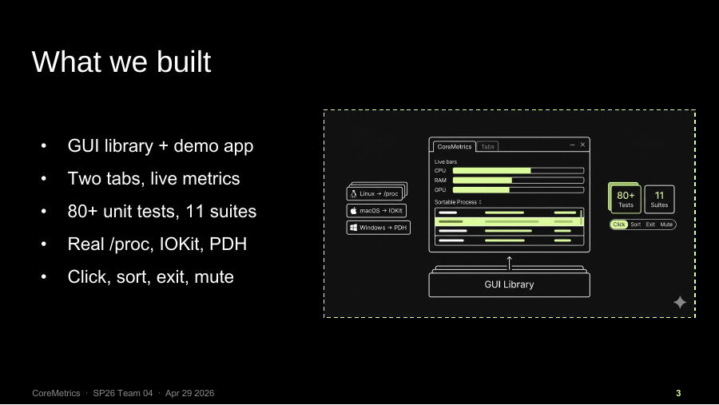
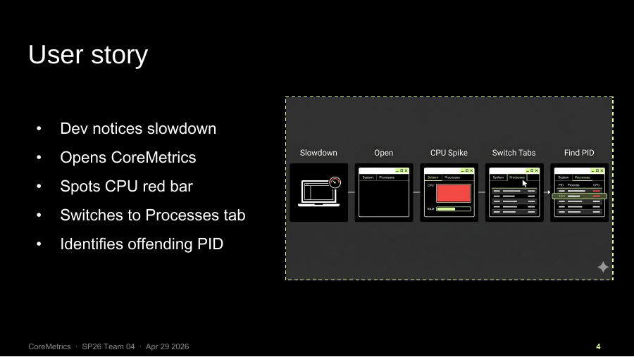
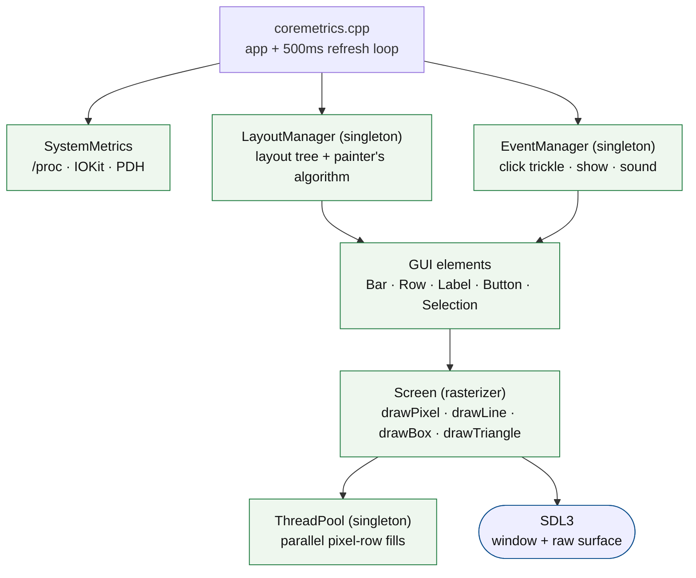
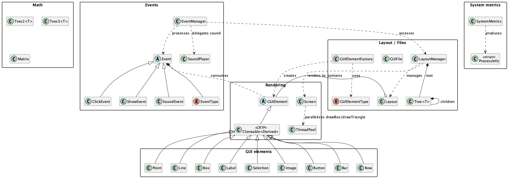

<div align="center">

# CoreMetrics

**A real-time system process monitor on a from-scratch 2D graphics engine.**

[](https://github.com/sviatil0/coremetrics/actions/workflows/c-cpp.yml)
[](LICENSE)


</div>

CoreMetrics shows live CPU, RAM, and GPU usage and a sortable process table, built in
**C++23** on a **2D graphics library written from the pixel up**. SDL3 supplies only the
window and the raw surface; every drawing primitive, layout, widget, event, and sound
above that lives in this repo: templated vector math, a Bresenham rasterizer, an
event-driven GUI layer, and a thread pool that parallelizes wide pixel fills.



## What it does

A developer notices a slowdown, opens CoreMetrics, sees the CPU bar turn red, switches to
the Processes tab, and finds the offending PID.



- **Live CPU / RAM / GPU bars**, sampled from real OS sources: `/proc` on Linux, IOKit on
  macOS, PDH on Windows (one platform file compiled per target).
- **A sortable process table** (by PID, name, CPU, memory).
- **A load alarm** that fires with sound past an 80% utilization threshold.
- **Two tabs**, event-driven switching, click / sort / exit / mute.

## My contribution

Team project (Notre Dame CSE 40232, Software Engineering, Spring 2026): four people, three
months, a PR-based workflow with code review on every merge (~70 merge commits in the
history). I was the lead and primary author. `git blame` across every source file:


```
me            ███████████████████████████████████░░░░░░░░░░░░░  71%   (4,943 lines)
Alicia        ████████░░░░░░░░░░░░░░░░░░░░░░░░░░░░░░░░░░░░░░░░░░  16%   (1,138 lines)
mcastel5      ██████░░░░░░░░░░░░░░░░░░░░░░░░░░░░░░░░░░░░░░░░░░░░  12%   (  805 lines)
```

What is mine: the vector / matrix math, the `Screen` rasterizer (Bresenham lines,
barycentric triangle fill) and its pixel tests, all three `SystemMetrics` platform
backends (`/proc`, IOKit, PDH), the GUI element hierarchy and factory, and the parallel
`drawBox` / `drawTriangle` call-sites. The `ThreadPool` itself and `Cloneable` were
written by teammates; I wrote the rasterizer code that uses them. Reproduce the per-file
split yourself:

```sh
git ls-files '*.cpp' '*.hpp' '*.h' | while read f; do
  git blame --line-porcelain "$f"; done | grep '^author ' | sort | uniq -c | sort -rn
```

Released publicly with the team's and instructor's consent under LGPL-2.1.

## Build and run

Dependencies: SDL3, SDL3_ttf, SDL3_image.

```sh
brew install sdl3 sdl3_ttf sdl3_image                              # macOS
# sudo apt install libsdl3-dev libsdl3-ttf-dev libsdl3-image-dev   # Debian/Ubuntu

make            # builds bin/coremetrics
make test       # 80+ unit tests across 11 suites
./bin/coremetrics
```

Builds clean under C++23 (`g++ -std=c++23 -Wall`); CI is green on Ubuntu and macOS.

## Verifying it works

```sh
make test                        # 80+ unit tests across 11 suites
./run-cross-platform-tests.sh    # the suite on macOS (native) + Linux (Docker)
./stress.sh                      # spikes CPU/RAM/GPU so you can watch the bars react
```

`stress.sh` spawns real load (multi-worker CPU burn, a Python RAM allocation, and
`glmark2` / `stress-ng` on the GPU), so the live bars actually move under pressure; it is
how the monitor is demoed, not just unit-tested in isolation.

## How it fits together



Detailed PlantUML class diagrams, grouped by package:

| Overview | Core | GUI | Layout | Events | Metrics |
|---|---|---|---|---|---|
| [overview](assets/overview.png) | [core](assets/core.png) | [gui](assets/gui.png) | [layout](assets/layout.png) | [events](assets/events.png) | [metrics](assets/metrics.png) |



## Slides

A short [final presentation](docs/CoreMetrics-Final-Presentation.pdf) walks through the
architecture, the cross-platform proof, and a demo.

## Engineering highlights

- **From-scratch rasterizer.** `Screen` plots pixels, Bresenham lines, filled boxes and
  triangles directly onto an SDL surface it owns via RAII. No SDL draw calls above the raw
  surface.
- **Parallel fills.** `drawBox` / `drawTriangle` partition their pixel rows into disjoint
  bands and dispatch them across a worker pool, joining on `std::future` (the pool itself
  is a teammate's; the rasterizer call-sites are mine).
- **Cross-platform metrics behind one header.** `SystemMetrics` is platform-agnostic at
  the interface; `_linux` (`/proc`), `_mac` (IOKit / `host_statistics`), and `_win` (PDH /
  toolhelp) implementations are selected by `#ifdef`, so only one contributes symbols.
- **Patterns where they pay off.** Singleton (`LayoutManager`, `EventManager`,
  `ThreadPool`, `SoundPlayer`), factory (`GUIElementFactory`), CRTP prototype
  (`Cloneable<Derived>` for deep-copying `unique_ptr<GUIElement>` trees), painter's
  algorithm for the layout tree.
- **Event-driven, atomic tab switch.** Each tab button emits a hide + a show `ShowEvent`;
  both drain in one `processEvents` pass.

<details>
<summary><strong>Full API reference (per-class)</strong></summary>

### Matrix
3x3 float matrix. `operator*` (multiply), `operator==`, `toTranspose()`.

### Tvec2&lt;T&gt; / Tvec3&lt;T&gt;
Templated (int or float) vectors with int/float conversion and overloaded `== + - * += -= *= []`.
`dot`, `magnitude` (Euclidean for float, L1/Manhattan for int), `unit`; `Tvec3` adds `cross`.

### Screen
Rasterizer over an SDL surface. `drawPixel`, `drawLine` (Bresenham, all orientations),
`drawBox`, `drawTriangle` (cross-product fill, CW or CCW), `blitTo(SDL_Surface*)`.

### GUIElement (ABC) + Cloneable&lt;Derived&gt;
Pure-virtual `draw(Screen&)`, `operator()(Event*)` (trickle handler), `clone()`. `Cloneable`
is a CRTP mixin giving each concrete element `clone()` / covariant `cloneDerived()` for free,
plus a free `cloneUnique<T>` helper.

### Concrete elements: Point, Line, Box, Label, Selection, Image, Button, Bar, Row
`Point`/`Line`/`Box` draw their primitive. `Label` lays out a box-per-character text
footprint. `Selection` is a stateful checkbox (`toggle`, `isSelected`). `Image` plots a BMP
pixel-by-pixel (RGBA8888, transparency-aware). `Button` hit-tests clicks and pushes
`SoundEvent` / `ShowEvent`. `Bar` is a threshold-colored progress bar (yellow >60%, red
>80%). `Row` is an N-cell tabular strip (PID / NAME / CPU% / MEM%).

### GUIElementFactory
Static factory mapping a `GUIElementType` to a heap-allocated element: `createPoint`,
`createLine`, `createBox`, and a generic `create(type, pos1, pos2, color)`.

### Tree&lt;T&gt; / Layout / LayoutManager
`Tree<T>`: generic tree, owning `unique_ptr` children + non-owning parent pointer. `Layout`:
a relative-coordinate (0–1) screen region holding `GUIElement`s, deep-copyable via the CRTP
`clone`. `LayoutManager` (singleton): owns the root `Tree<Layout>` and renders it with the
painter's algorithm (parent before children).

### Events: Event (ABC), ClickEvent, ShowEvent, SoundEvent, EventManager
Typed events (no downcasting). `EventManager` (singleton) drains a queue: clicks trickle
top-down until consumed, shows toggle a named layout, sounds delegate to `SoundPlayer`.

### SoundPlayer
Singleton WAV playback through an SDL3 audio stream (44.1 kHz, mono, f32).

### ThreadPool
Singleton worker pool (`hardware_concurrency`). `submit(F&&) -> std::future<void>`; callers
partition pixel rows across it. Copy/assign deleted; destructor signals stop and joins.

### GUIFile
Loads / stages / saves GUI layout elements to and from an XML schema. Vectors of
`Point`/`Line`/`Box`; getters return by value for read-only access; `readFile` clears before
parsing; `writeFile` emits an indented schema.

### SystemMetrics
Static cross-platform metrics. `readCpuPercent()` (delta-based, 0 on first call),
`readMemPercent()`, `topProcesses(n)` (by memory, each with pid/name/cpuPct/memPct). Linux
reads `/proc`; macOS uses `host_statistics` + `proc_*`; Windows uses `GetSystemTimes` +
toolhelp.

### CoreMetrics demo (`coremetrics.cpp`)
Two-tab monitor. System tab: live CPU/RAM bars with numeric readouts. Processes tab: sortable
PID/NAME/CPU%/MEM% rows. Tab switching is event-driven and atomic. Metrics refresh every
500 ms; the loop mutates Bars/Rows/Labels in place (no scene rebuild).

</details>

<details>
<summary><strong>Original course engineering spec</strong> (requirements the team built against)</summary>

### Design and architecture rules
- Avoid code smell; keep non-public helpers private.
- `#ifndef` header guards (no `#pragma once`).
- No exceptions or assertions; print to `std::cerr` and handle every corner case without crashing.
- No print statements in production code.
- File-local helpers are `static`.
- No lambda functions.

### Style
camelCase variables/free-functions, PascalCase classes, `CAPITALIZED_SNAKE_CASE` constants,
no magic numbers (`const`/`constexpr`), Allman braces, full braces on every control block.

### Cross-platform notes
- `SystemMetrics` splits into `_linux` / `_mac` / `_win` source files, guarded by
  `#ifdef __linux__` / `__APPLE__` / `_WIN32`.
- macOS links `-framework IOKit -framework CoreFoundation` for GPU via `IOServiceMatching("IOAccelerator")`.
- Linux GPU usage from `/sys/class/drm/card0/device/gpu_busy_percent` (AMD; NVIDIA/NVML is backlog).
- Windows GPU usage via PDH `\GPU Engine(*)\Utilization Percentage`.

### Known limitations
- Per-process GPU attribution is not exposed (only total GPU usage per platform).
- The Windows GUI is not visually verified end-to-end; visual interaction is verified on
  macOS and Linux. CI is gated on Linux + macOS for this reason.

### Team workflow
- A PR per change using the repo's PR template; every PR reviewed by a teammate before merge.
- Trello board: Backlog → Active → Review → merge; full test suite run locally before pushing.

</details>

## License

[LGPL-2.1](LICENSE). Team project, released with the team's and instructor's consent.
